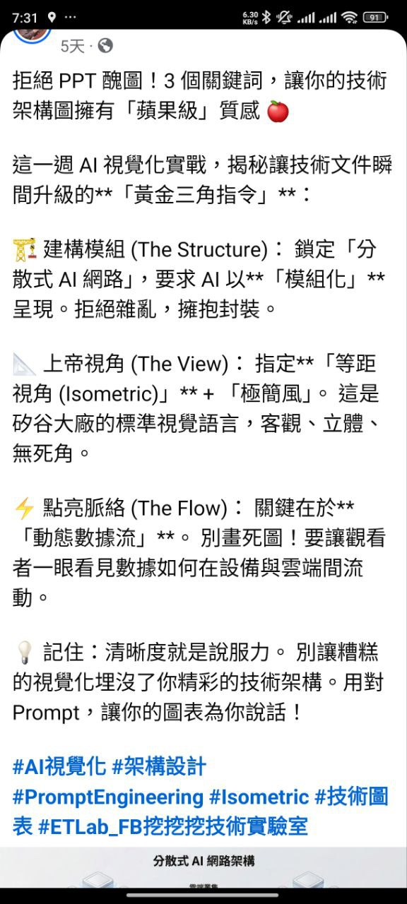
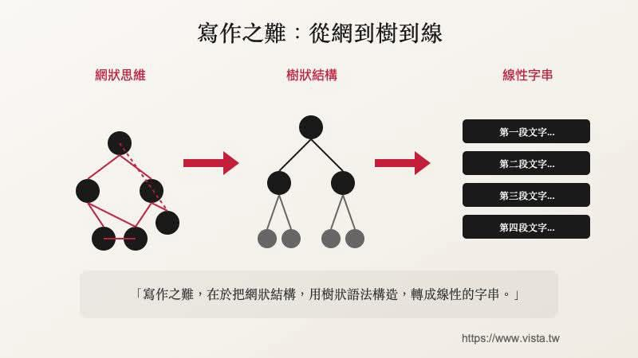

# 任務：編譯「開發工具與工作流」知識 Wiki 頁

你是 SecondBrain 知識編譯器。以下是「開發工具與工作流」主題下的 39 篇筆記摘要。
主題描述：開發工具、CLI、自動化腳本、Discord/Telegram bot、DevOps

## 要求

請根據以下筆記內容，產出一篇結構化的知識 Wiki 頁，格式如下：

```
---
title: "開發工具與工作流 — 知識 Wiki"
date: 2026-04-23
type: wiki
content_layer: L3
topic: dev-tools
source_count: 39
last_compiled: 2026-04-23
_skip_sync: true
---

# {主題名稱} — 知識 Wiki

## 主題概述
(2-3 段，概括此主題的核心範圍、為何重要、目前發展階段)

## 核心概念
(列出 5-10 個核心概念，每個用 ### 小節，2-3 句說明 + Wiki Link 引用來源筆記)

## 關鍵發現
(從筆記中提煉的重要洞見，每條用 > blockquote + 來源 Wiki Link)

## 跨筆記關聯
(不同筆記之間的連結、矛盾、演進關係)

## 待探索方向
(筆記中提到但尚未深入的議題，供未來研究)
```

## 引用規則

- 每個段落都必須用 `[[note-filename]]` 或 `[[note-filename|顯示名稱]]` Wiki Link 引用來源筆記
- filename 就是下方每篇筆記的 `filename` 欄位（不含 .md）
- 不要虛構不存在的筆記名稱

---

## 筆記清單（共 39 篇）

### [1/39] Hermes Agent × Telegram × LLM Wiki — AI 補助案助手架構分析與機會研究
- **filename**: `2026-04-18_Hermes-Agent-AI補助案助手架構分析與機會研究`
- **path**: `dispatch-outputs/2026-04-18_Hermes-Agent-AI補助案助手架構分析與機會研究.md`
- **date**: 2026-04-18
- **category**: tool-analysis
- **tags**: Hermes-Agent, Telegram, LLM-Wiki, ChatGPT, government-grants, SBIR, SIIR, CITD, AI-agent, automation, business-opportunity

**內容摘要：**

## 原始貼文摘要

一位計劃輔導顧問分享了他用「Hermes Agent × Telegram × LLM Wiki × ChatGPT」串起來的 AI 計劃書助手：

1. 每天定期巡查相關網站，追最新補助公告，下載相關資料
2. 根據下載的申請須知，自動產生訪綱與索資清單
3. 針對特定計劃內容做即時問答，不用再翻 PDF
4. 具備長短期記憶，知道目前在處理哪一案、哪個計劃、還缺什麼資料

定位：第一個能協助計劃輔導顧問工作的「AI 員工」。

---

## Part 1：系統架構分析

### 各元件角色

**Hermes Agent**（Nous Research 開源框架）
- GitHub 95.6K+ stars 的開源 AI Agent 框架
- 內建 Cron 排程（定時巡查網站）、Telegram Bot 整合、40+ 工具
- 支援 Function Calling，可串接各種 API
- 在此系統中扮演「排程引擎 + 任務調度器」角色
- 官方：https://github.com/NousResearch/Hermes-Function-Calling
(...截斷)

---

### [2/39] Glance 自架儀表板可用性分析
- **filename**: `2026-04-10_Glance自架儀表板可用性分析`
- **path**: `dispatch-outputs/2026-04-10_Glance自架儀表板可用性分析.md`
- **date**: 2026-04-10
- **category**: tech/tools
- **tags**: Glance, dashboard, self-hosted, DevOps, 監控, RSS, Docker, homelab

**內容摘要：**

## 摘要

分析 Glance 這個 Go 語言編寫的輕量自架儀表板專案，評估其作為 Alan 個人基礎設施統一監控面板的可行性。結論：Glance 非常適合作為「資訊聚合 + 輕量監控」的首頁儀表板，部署成本極低，對 Alan 的 sustainability-100 新聞管線、DesignClaw ComfyUI 機器監控、AI 資訊追蹤等需求覆蓋率高。建議以 Docker Compose 部署在 ac-mac 上，搭配 Tailscale 遠端存取。

## 背景

Alan 目前的基礎設施分散在多處：ac-mac 跑 sustainability-100 新聞管線、3090 機器跑 DesignClaw 的 ComfyUI、多個 GitHub repo（Claw 生態系）、SecondBrain 知識庫。缺乏一個統一的「一眼看全局」面板，需要一個低維護成本的 dashboard 來整合資訊流與基本監控。

## 分析內容

### 一、專案基本資料與活躍度

| 指標 | 數值 |
|------|------|
| GitHub Stars | 33.2k |
| Fork
(...截斷)

---

### [3/39] Better Agent Terminal：統一 CLI Agent 調度中心可行性分析
- **filename**: `2026-04-09_Better-Agent-Terminal統一CLI調度中心分析`
- **path**: `dispatch-outputs/2026-04-09_Better-Agent-Terminal統一CLI調度中心分析.md`
- **date**: 2026-04-09
- **category**: tech/tools
- **tags**: CLI, agent-terminal, Claude-Code, Codex, Gemini-CLI, electron, xterm, multi-agent, dispatch

**內容摘要：**

## 專案概覽

Better Agent Terminal (BAT) 是一個 Electron 桌面終端聚合器，讓你在同一個視窗管理多個 AI Agent CLI。技術棧：React 18 + xterm.js + node-pty，Google Meet 風格的 70/30 主面板 + 縮圖列佈局。

### 已內建的 Agent Preset

- Claude Code (`claude`)
- Gemini CLI (`gemini`)
- OpenAI Codex (`codex`)
- GitHub Copilot (`gh copilot`)
- Aider (`aider`)
- 支援自訂新 Agent

### 核心功能

1. **多終端管理**：每個 Agent 一個獨立 PTY，可同時運行
2. **工作區管理**：支援不同專案切不同工作區
3. **快捷切換**：主視窗 + 縮圖預覽，一鍵切 Agent
4. **統一配置**：所有 Agent 的啟動指令集中管理

---

## 作為統一調度中心的可行性評估

### ✅ 已具備

- 多 Agent 
(...截斷)

---

### [4/39] Graphify 知識圖譜工具分析與 SecondBrain 整合評估
- **filename**: `2026-04-09_Graphify知識圖譜工具分析與SecondBrain整合評估`
- **path**: `dispatch-outputs/2026-04-09_Graphify知識圖譜工具分析與SecondBrain整合評估.md`
- **date**: 2026-04-09
- **category**: tech/tools
- **tags**: Graphify, knowledge-graph, Karpathy, knowledge-compilation, SecondBrain, Obsidian, RAG, Leiden

**內容摘要：**

## Graphify 是什麼？

Graphify 是受 Andrej Karpathy「知識編譯」工作流啟發的開源工具，三天內在 GitHub 狂掃 15,000+ Stars。核心理念：與其用 RAG 搜尋，不如讓 LLM 把資料夾「編譯」成結構化知識圖譜。

### 核心架構

1. **語意提取**：用 LLM 掃描每個檔案，提取 entities（概念、人名、術語）和 relationships
2. **圖譜建構**：用 NetworkX 建構知識圖譜，節點 = 概念，邊 = 關聯
3. **社群偵測**：用 Leiden 演算法自動發現主題群集（communities）
4. **查詢導航**：查詢時不讀所有檔案，而是沿圖譜導航到精確節點

### 宣稱特點

| 特點 | 說明 |
|------|------|
| Token 消耗降 71.5 倍 | 圖譜導航取代全文讀取 |
| 不需 Vector DB | 不用調校 Embedding 或維護向量庫 |
| 全模態 | 20 種程式語言 + PDF + 圖片 + 截圖 |
| 自動 Backlinks | 生成
(...截斷)

---

### [5/39] Graphify RAG 機制與對話知識庫方案深度分析
- **filename**: `2026-04-09_Graphify-RAG機制與對話知識庫方案深度分析`
- **path**: `dispatch-outputs/2026-04-09_Graphify-RAG機制與對話知識庫方案深度分析.md`
- **date**: 2026-04-09
- **category**: tech/tools
- **tags**: Graphify, RAG, knowledge-graph, Obsidian, Karpathy, SecondBrain, Khoj, Smart-Connections, compile, enrich

**內容摘要：**

## 你問的七個問題，逐一回答

---

## 1. Graphify 如何建立 RAG DB？

**Graphify 完全不用 Vector DB。** 它用的是 Graph-based Retrieval，而非傳統的 Vector-based RAG。

底層機制：

```
你的檔案 → LLM 語意提取 → entities + relationships
                ↓
         NetworkX 知識圖譜（節點 = 概念，邊 = 關聯）
                ↓
         Leiden 社群偵測（自動分群）
                ↓
         查詢時沿圖譜路徑導航（不是向量相似度搜尋）
```

| 維度 | 傳統 RAG | Graphify |
|------|---------|----------|
| 儲存 | Vector DB（Pinecone/Chroma/Weaviate） | NetworkX 圖（JSON/pickle） |
| 索引 | Embedding 向量 | Entity +
(...截斷)

---

### [6/39] gemgate × BAT × Copilot：統一 CLI Agent 調度中心完整實作指南
- **filename**: `2026-04-09_gemgate-BAT-Copilot整合實作指南`
- **path**: `dispatch-outputs/2026-04-09_gemgate-BAT-Copilot整合實作指南.md`
- **date**: 2026-04-09
- **category**: tech/architecture
- **tags**: gemgate, BAT, better-agent-terminal, copilot, CLI, agent-dispatch, architecture, implementation

**內容摘要：**

## 核心架構：gemgate 是大腦，BAT 是身體

```
┌─────────────────────────────────────────────────┐
│  Better Agent Terminal (BAT) — UI Shell          │
│  React 18 + xterm.js + node-pty                  │
│  ┌──────────┐ ┌──────────┐ ┌──────────┐        │
│  │ Claude   │ │ Copilot  │ │ Gemini   │  ...    │
│  │ Terminal │ │ Terminal │ │ Terminal │        │
│  └────┬─────┘ └────┬─────┘ └────┬─────┘        │
│       │            │            │               │
│  ─────┴────────────┴────────────┴───────        │

(...截斷)

---

### [7/39] Discord 作為 AI Agent 控制台的選型分析
- **filename**: `2026-04-06_Discord作為AI-Agent控制台分析`
- **path**: `dispatch-outputs/2026-04-06_Discord作為AI-Agent控制台分析.md`
- **date**: 2026-04-06
- **category**: tech-analysis
- **tags**: Discord, OpenClaw, AI-agent, 龍蝦, multi-agent, Claude-Code-Channels, Telegram

**內容摘要：**

## 背景

一位重度 OpenClaw（龍蝦）使用者分享了三個月的使用心得，API 花費累積超過 $1,500 USD。從 Telegram → Line → Telegram → WebChat，最終全部搬到 Discord。核心發現：模型聰不聰明是一回事，介面怎麼管理 Session 才是決定能不能多工作業的關鍵。

## 一、社群工具選型比較

### Telegram

- 適合「單兵快速指令」，手機上丟一句話讓龍蝦去跑
- Claude Code Channels 官方支援，設定最簡單
- 缺點：單線程對話，無法平行追蹤多任務
- 定位：一對一、輕量指令、行動優先

### Line

- 基本不適合 AI agent 使用
- API 限制多、Bot 生態封閉、無 thread 概念、群組功能弱
- 不建議使用

### Discord（最佳解）

- 天生三層結構：Server → Channel → Thread
- 每一層都可獨立承載一個 agent session
- 支援多 bot 在同一 channel 互相讀訊息
- 定位：多 agent 控制台、長期任務追
(...截斷)

---

### [8/39] Teachify 開課快手研究與 ClassClaw 整合分析
- **filename**: `2026-04-04_Teachify開課快手研究與ClassClaw整合分析`
- **path**: `dispatch-outputs/2026-04-04_Teachify開課快手研究與ClassClaw整合分析.md`
- **date**: 2026-04-04
- **category**: tech/tools
- **tags**: Teachify, ClassClaw, 線上課程, API, 自動化, SaaS

**內容摘要：**

# Teachify 開課快手 平台研究報告

> 研究日期：2026-04-04
> 目的：分析 Teachify 平台能力，評估與 ClassClaw 教育自動化管線的整合可行性

---

## 1. Teachify 開課快手是什麼？

Teachify 開課快手是一個**台灣本土的 SaaS 線上開課平台**，成立於 2019 年，專注於讓創作者與講師快速建立自己的獨立數位知識商店。它的定位是「知識電商」——結合自架網站與課程系統的一站式解決方案。

### 核心特色

- **自架品牌網站**：每位用戶擁有獨立網域的課程網站，30 秒內即可註冊建站
- **多元內容格式**：支援影片課程、數位產品下載、直播活動、訂閱制文章專欄
- **台灣在地化金流**：信用卡、ATM 轉帳、超商繳費、LINE PAY，並支援電子發票
- **零抽成模式**：不抽取課程銷售分潤（一般平台抽 5-12%），僅收月費
- **繁體中文後台**：完整中文介面，對台灣創作者友善

### 方案價格

| 方案 | 月均費用 | 適合對象 |
|------|---------|---------|
(...截斷)

---

### [9/39] claude-token-efficient — 9 行 CLAUDE.md 減少 63% 輸出 token
- **filename**: `2026-04-03_Claude-Token-Efficient-CLAUDE-md`
- **path**: `dispatch-outputs/2026-04-03_Claude-Token-Efficient-CLAUDE-md.md`
- **date**: 2026-04-03
- **category**: tech/tools
- **tags**: Claude-Code, token優化, CLAUDE.md, prompt工程, 成本控制

**內容摘要：**

# claude-token-efficient — 9 行 CLAUDE.md 減少 63% 輸出 token

## 摘要

drona23/claude-token-efficient 是一個只有 9 行的 CLAUDE.md 檔案，丟進專案根目錄即可生效，透過禁止 Claude Code 的拍馬屁開頭、空洞結尾、重複問題、未被要求的建議等行為，聲稱可減少輸出 token 63%。1,900+ stars。實際效果取決於使用場景，重度使用者（日均 100+ prompt）才有明顯省錢效果。

## 背景

Claude Code 預設行為傾向冗長——每次回覆都帶 "Sure! Great question!" 開頭、"hope this helps!" 結尾、重述使用者問題、加入未被要求的建議。這些行為在單次對話中只是小麻煩，但在重度開發場景下（一天跑上百個 prompt），累積的 token 成本非常可觀。

## 分析內容

### 核心指令（9 行 CLAUDE.md）

```markdown
- Think before acting. Read existing fi
(...截斷)

---

### [10/39] Cloudflare EmDash — 開源 AI 原生 CMS 分析
- **filename**: `2026-04-03_Cloudflare-EmDash-CMS分析`
- **path**: `dispatch-outputs/2026-04-03_Cloudflare-EmDash-CMS分析.md`
- **date**: 2026-04-03
- **category**: tech/tools
- **tags**: CMS, Cloudflare, EmDash, WordPress, AI原生, 開源, Astro, MCP

**內容摘要：**

# Cloudflare EmDash — 開源 AI 原生 CMS 分析

## 摘要

Cloudflare 於 2026/4/1 發布 EmDash（v0.1.0 預覽版），定位為 WordPress 的「精神繼承者」。採用 TypeScript + Astro 6.0 重建，最大亮點是外掛沙箱安全模型和 AI 原生設計（內建 MCP 伺服器）。架構理念先進但生態幾乎為零，目前適合技術導向的早期採用者。

## 背景

WordPress 驅動全球 43% 的網站，但 96% 的安全漏洞來自外掛（因為外掛可存取整個系統）。Cloudflare 試圖用現代技術從架構層面解決這個問題。EmDash 由 AI 編碼代理在兩個月內建成，本身也是 AI 輔助開發的案例。

## 分析內容

### CMS 在網站系統中的角色

CMS（Content Management System）是網站的「內容後台」，讓使用者不用寫程式就能管理網站內容。核心功能包括：所見即所得的內容編輯器、使用者權限管理、媒體檔案管理、REST API / GraphQL 介面、外掛擴充系統、主題模板系統、SEO 
(...截斷)

---

### [11/39] Claude Code Skills 推薦清單（三層架構）
- **filename**: `2026-03-06-claude-code-skills-推薦清單`
- **path**: `tech/tools/2026-03-06-claude-code-skills-推薦清單.md`
- **date**: 2026-03-06
- **category**: tech/tools
- **tags**: claude-code, skills, ai-tools, productivity, automation

**內容摘要：**

# Claude Code Skills 推薦清單（三層架構）

## 📊 元資訊
- **難度**：⭐⭐
- **來源類型**：文章 / 資源清單
- **作者**：BrowserAct
- **筆記時間**：2026-03-06 11:04

## 📌 摘要
整理 Claude Code Skills 的三層推薦架構，從官方必裝的文件處理 Skills，到進階實用工具，最後是最具影響力的 Skill Creator 和 Superpowers。這份清單幫助使用者系統化地建立 Claude Code 的能力擴展。

## 🏷️ 標籤分類
- **大分類**：tech
- **小分類**：tools

## 🔑 關鍵要點
1. **Layer 1（必裝）**：Anthropic 官方四件套 — PDF、DOCX、PPTX、XLSX 文件處理
2. **Layer 2（進階）**：前端設計、SEO、行銷、Obsidian 整合等專業領域 Skills
3. **Layer 3（核心）**：Skill Creator（自建 Skill）+ Superpowers（需求分析優先）
4. 作者
(...截斷)

---

### [12/39] OpenClaw 實戰書籍目錄（第三部分）- Canvas、Twilio 語音與附錄
- **filename**: `2026-03-06-openclaw-book-toc-part3`
- **path**: `tech/tools/2026-03-06-openclaw-book-toc-part3.md`
- **date**: 2026-03-06
- **category**: tech/tools
- **tags**: OpenClaw, AI Agent, Canvas, Twilio, Voice Call, CLI, TUI, 設定檔

**內容摘要：**

# OpenClaw 實戰書籍目錄（第三部分）- Canvas、Twilio 語音與附錄

## 📊 元資訊
- **難度**：⭐⭐⭐
- **來源類型**：書籍目錄
- **作者**：Alan Chen
- **筆記時間**：2026-03-06 10:14

## 📌 摘要
OpenClaw 實戰書籍的後半部分，包含第十章的 Canvas 互動內容、第十一章的 Twilio 語音通話整合，以及三個完整的附錄：CLI 指令大全、TUI 斜線指令大全、openclaw.json 設定大全。

## 🏷️ 標籤分類
- **大分類**：tech
- **小分類**：tools

## 🔑 關鍵要點

### 第十章後半：Canvas 互動功能
1. **Canvas 基礎**：理解 Canvas 是什麼、如何啟用
2. **實戰應用**：天氣圖表、互動式倒數計時器
3. **Talk Mode**：語音與 Agent 對話模式

### 第十一章：Twilio 語音通話
1. **Twilio 註冊流程**：帳號建立、電話驗證、Trial 方案
2. **Onboarding 設定**：
(...截斷)

---

### [13/39] ClaudeBot - 透過 Telegram 打造的行動 AI 開發環境
- **filename**: `2026-03-06-ClaudeBot-Telegram-AI-IDE`
- **path**: `tech/tools/2026-03-06-ClaudeBot-Telegram-AI-IDE.md`
- **date**: 2026-03-06
- **category**: tech/tools
- **tags**: Claude, Telegram, Bot, AI-IDE, 遠端開發, MCP, 語音轉文字

**內容摘要：**

# ClaudeBot - 透過 Telegram 打造的行動 AI 開發環境

## 📊 元資訊
- **難度**：⭐⭐⭐⭐
- **來源類型**：開源專案 + 社群分享
- **作者**：Jeffrey0117
- **筆記時間**：2026-03-06 11:02

## 📌 摘要
ClaudeBot 是一個透過 Telegram Bot 串接 Claude CLI 的開發工具，讓開發者可以用手機遠端控制 AI 編輯程式碼。不同於一般的聊天機器人包裝，它是完整的開發平台，支援即時串流、多層記憶系統、語音輸入、跨機器遠端協作等功能。作者表示透過這個工具已經產生超過 20 萬行實際使用的程式碼。

## 🏷️ 標籤分類
- **大分類**：tech
- **小分類**：tools
- **核心關鍵字**：Telegram Bot、Claude Code、AI IDE、遠端開發

## 🔑 關鍵要點

1. **從 VSCode 到 CLI 再到 Telegram 的演進**
   - VSCode 插件 → CLI + Windows Terminal 多分頁 → Telegram 
(...截斷)

---

### [14/39] 玩爆你的龍蝦 — 最強 OpenClaw 安裝設定應用實機演練
- **filename**: `2026-03-06-玩爆你的龍蝦-OpenClaw安裝設定應用實機演練`
- **path**: `tech/ai-ml/2026-03-06-玩爆你的龍蝦-OpenClaw安裝設定應用實機演練.md`
- **date**: 2026-03-06
- **category**: tech/ai-ml
- **tags**: OpenClaw, AI Agent, 技術書籍, 台灣原創, LINE Bot, Telegram, 多機協作

**內容摘要：**

# 玩爆你的龍蝦 — 最強 OpenClaw 安裝設定應用實機演練

## 📊 元資訊
- **難度**：⭐⭐⭐
- **來源類型**：新書預購公告
- **作者**：Alan Chen（本人）
- **筆記時間**：2026-03-06 10:11

## 📌 摘要
中文第一本 OpenClaw（龍蝦）專書在天瓏開始預購！從龍蝦發布到成書僅花 14 天，涵蓋完整安裝設定、LINE/Telegram 整合、多機協作 Nodes 架構等實戰內容。

## 🏷️ 標籤分類
- **大分類**：tech
- **小分類**：ai-ml

## 🔑 關鍵要點
1. **中文第一本 OpenClaw 專書**：填補繁體中文市場空白
2. **14 天閃電寫作**：從工具發布到成書的超高效率
3. **LINE 完整設定**：最多人詢問的整合教學
4. **多機協作 Nodes**：控制其他電腦、手機、平板的進階功能
5. **五章完整架構**：從概念理解到正式域名部署

## 💬 金句摘錄
> "從龍蝦一出來，馬上安裝在 Linux 中，然後第二天立即訂了 Mac Mini，第三天規劃書籍，第四
(...截斷)

---

### [15/39] World Monitor - 開源全球情報儀表板
- **filename**: `2026-03-04-World-Monitor-開源全球情報儀表板`
- **path**: `tech/tools/2026-03-04-World-Monitor-開源全球情報儀表板.md`
- **date**: 2026-03-04
- **category**: tech/tools
- **tags**: 開源專案, 情報儀表板, 地緣政治, AI, 即時監控, 數據視覺化

**內容摘要：**

# World Monitor - 開源全球情報儀表板

## 📊 元資訊
- **難度**：⭐⭐⭐
- **來源類型**：開源專案
- **作者**：koala73
- **授權**：MIT License
- **筆記時間**：2026-03-04 17:28
- **最新版本**：v2.5.21 (2026-03-01)

## 📌 摘要
World Monitor 是一個即時的全球情報儀表板，整合 AI 驅動的新聞彙整、地緣政治監控、基礎設施追蹤於統一的態勢感知介面中。提供三大分類：世界、科技、金融，並且完全開源，支援本地 LLM、多語言介面，讓每個人都能擁有個人版的「全球情資指揮中心」。

## 🏷️ 標籤分類
- **大分類**：tech
- **小分類**：tools
- **關鍵字**：開源、情報儀表板、地緣政治、即時監控、AI 摘要、3D 地球儀

## 🔑 關鍵要點

### 1. AI 與本地處理能力
- **四層式 LLM 回退機制**：Ollama (本地) → Groq (雲端) → OpenRouter (雲端) → 瀏覽器端 T5 模型
- 支援 **O
(...截斷)

---

### [16/39] SEO 行銷人用 Claude Code 工作流實戰
- **filename**: `2026-03-04-SEO行銷人用Claude-Code工作流實戰`
- **path**: `tech/tools/2026-03-04-SEO行銷人用Claude-Code工作流實戰.md`
- **date**: 2026-03-04
- **category**: tech/tools
- **tags**: Claude-Code, SEO, 行銷自動化, AI工作流, Firecrawl, 內容行銷

**內容摘要：**

# SEO 行銷人用 Claude Code 工作流實戰

## 📊 元資訊
- **難度**：⭐⭐⭐
- **來源類型**：部落格文章
- **作者**：Hiba Fathima（Firecrawl SEO 主管）
- **筆記時間**：2026-03-04 08:49

## 📌 摘要
Firecrawl 的 SEO 主管 Hiba Fathima 分享她如何用 Claude Code（包含 Desktop 版本）處理大部分行銷工作。核心觀點是：這不能取代工程師，但能消除「等別人排程」的問題，讓行銷人自己快速上線各種小工具和自動化流程。

## 🏷️ 標籤分類
- **大分類**：tech
- **小分類**：tools

## 🔑 關鍵要點

### Claude Code 的核心價值
1. **消除依賴等待**：以前活動頁面流程「設計師→工程師→驗收→修改」，現在想清楚就能直接上線
2. **專案級存取**：Claude Code 住在專案裡，能讀取整個目錄、跨檔案修改、執行指令
3. **非技術人員友善**：可用 Desktop App，拖拉截圖、貼圖片，不需面對終端機

#
(...截斷)

---

### [17/39] Claude Code Remote Control — 手機遠端操控 AI Coding Agent
- **filename**: `2026-03-01-claude-code-remote-control`
- **path**: `tech/tools/2026-03-01-claude-code-remote-control.md`
- **date**: 2026-03-01
- **category**: tech/tools
- **tags**: Claude, Claude Code, Anthropic, AI Agent, Remote Control, 開發工具

**內容摘要：**

# Claude Code Remote Control — 手機遠端操控 AI Coding Agent

## 📊 元資訊
- **難度**：⭐⭐
- **來源類型**：新聞/產品更新
- **作者**：未知
- **筆記時間**：2026-03-01 09:01

## 📌 摘要
Claude Code 推出 Remote Control 功能，讓使用者可以透過手機或瀏覽器遠端操控 CLI session。這解決了 AI coding agent 必須綁在終端機前的痛點，使用場景從桌面擴展到任何有手機的地方。

## 🏷️ 標籤分類
- **大分類**：tech
- **小分類**：tools

## 🔑 關鍵要點
1. **Remote Control 啟用方式**：在終端機輸入 `claude rc`，手機或瀏覽器即可接手 session
2. **端對端加密**：Anthropic 完全看不到使用者程式碼，滿足企業安全需求
3. **自動重連機制**：筆電闔上、網路斷線，session 不會中斷，恢復後自動接上
4. **多 session 支援**：手機 app 上可同時
(...截斷)

---

### [18/39] XQ-XS 裸K線技術分析腳本庫
- **filename**: `xq-xs-price-action-scripts`
- **path**: `tech/tools/xq-xs-price-action-scripts.md`
- **date**: 2026-03-01
- **category**: tech/tools
- **tags**: 技術分析, 股票, XQ軟體, 價格行動, 開源工具

**內容摘要：**

# XQ-XS 裸K線技術分析腳本庫

## 摘要

xq-xs 是為 XQ 全球贏家軟體用戶提供的裸 K 線（價格行動）技術分析腳本集合，包含多種實用的技術指標檢測工具，其他軟體使用者也可參考改寫。

## 關鍵要點

- **裸K策略工具**：專注於價格行動分析，提供移動平均線交叉、新高偵測等實用功能
- **即用腳本**：XQ 用戶可直接使用，其他平台需自行改寫適配
- **多種偵測器**：包含 5/60 日均線金叉計次、120 周新高、周線最大量查詢等功能
- **股本篩選**：提供股本條件篩選工具
- **開源共享**：中英雙語文檔，鼓勵社群貢獻與改進

## 主要功能

### 1. N日內5日線金叉60日線計次
- 偵測特定天數內短期均線向上突破長期均線的次數
- 適用於趨勢轉折訊號識別

### 2. 創120周新高偵測
- 自動檢測股價是否創下 120 週新高
- 用於長期趨勢強度判斷

### 3. 周線最大量位置查詢
- 找出週線圖上最大成交量發生的位置
- 輔助判斷關鍵支撐/壓力區域

### 4. 股本篩選工具
- 依據公司股本大小進行標的篩選

## 技術架
(...截斷)

---

### [19/39] Claude 桌面應用程式法律實務工作流程
- **filename**: `2026-03-01-claude-desktop-lawyer-workflow`
- **path**: `tech/ai-ml/2026-03-01-claude-desktop-lawyer-workflow.md`
- **date**: 2026-03-01
- **category**: tech/ai-ml
- **tags**: Claude, LegalTech, AI工作流, 提示工程, 律師, 自動化

**內容摘要：**

# Claude 桌面應用程式法律實務工作流程

## 📊 元資訊
- **難度**：⭐⭐⭐
- **來源類型**：專業經驗分享文章
- **作者**：法律從業者（兩人事務所經營者）
- **筆記時間**：2026-03-01 08:36

## 📌 摘要
一位律師分享如何運用 Claude 桌面應用程式的三種模式（Chat、Cowork、Code）徹底改變法律實務工作。透過自訂「技能」系統，將多年專業判斷編碼成可複用的指令文件，讓兩人事務所能處理大型事務所的工作量。

## 🏷️ 標籤分類
- **大分類**：tech
- **小分類**：ai-ml
- **延伸分類**：LegalTech、工作流程自動化

## 🔑 關鍵要點

### Claude 桌面版三種模式
1. **Chat（對話）**：像與初級律師交談，分析問題、構思策略、草擬文件
2. **Cowork（協作）**：指向資料夾後自主執行任務，讀取/創建/編輯文件（對實務影響最大）
3. **Code（程式碼）**：建立自訂工具，如法律文件轉語音音訊

### 六大核心技能
1. 合約審查（四種模式、嚴重程度評等、缺失
(...截斷)

---

### [20/39] AI 視覺化實戰——技術架構圖的「黃金三角指令」
- **filename**: `2026-02-03-AI視覺化黃金三角指令`
- **path**: `tech/tools/2026-02-03-AI視覺化黃金三角指令.md`
- **date**: 2026-02-03
- **category**: tech/tools
- **tags**: AI視覺化, 架構設計, Prompt Engineering, Isometric, 技術圖表

**內容摘要：**

# AI 視覺化實戰——技術架構圖的「黃金三角指令」

## 📊 元資訊
- **來源**：Facebook「ETLab_FB 挖挖挖技術實驗室」
- **收錄時間**：2026-02-03 09:07:10
- **類型**：社群貼文截圖

## 📷 原始圖片


## 📌 摘要
用 AI 生成技術架構圖時，掌握三個關鍵 Prompt 指令（黃金三角），就能讓圖表從「PPT 醜圖」升級為「蘋果級」質感。核心是：模組化結構、等距視角、動態數據流。

## 🔑 黃金三角指令

### 1. 建構模組 The Structure
- 鎖定「分散式 AI 網路」主題
- 要求 AI 以**「模組化」**呈現
- 原則：拒絕雜亂，擁抱封裝

### 2. 上帝視角 The View
- 指定**「等距視角（Isometric）」**+**「極簡風」**
- 這是矽谷大廠的標準視覺語言
- 特點：客觀、立體、無死角

### 3. 點亮脈絡 The Flow

(...截斷)

---

### [21/39] 寫作之難：從網到樹到線
- **filename**: `2026-02-03-寫作之難從網到樹到線`
- **path**: `tech/tools/2026-02-03-寫作之難從網到樹到線.md`
- **date**: 2026-02-03
- **category**: tech/tools
- **tags**: 寫作方法, 思維結構, 資訊架構, 知識管理, 內容創作

**內容摘要：**

# 寫作之難：從網到樹到線

## 📊 元資訊
- **來源**：vista.tw（鄭緯筌 Vista）
- **收錄時間**：2026-02-03 09:08:05
- **類型**：概念圖

## 📷 原始圖片


## 📌 摘要
寫作的核心難點在於三層轉換：將腦中的**網狀思維**，組織成**樹狀結構**，最終輸出為**線性字串**（文章段落）。這張圖精確描述了寫作過程中思維→結構→文字的轉換本質。

## 🔑 三層轉換模型

### 1. 網狀思維（起點）
- 大腦中的想法是**網狀**的，節點之間互相連結、交叉引用
- 沒有明確的起點和終點，充滿跳躍和關聯
- 這是最自然的思考方式，但無法直接呈現給讀者

### 2. 樹狀結構（中間層）
- 從網狀中提取出**層級關係**，建立主幹→分支→葉節點
- 決定哪些是主要論點、哪些是支撐細節
- 這一步是**大綱規劃**的過程

### 3. 線性字串（輸出）
- 最終將樹狀結構**攤平**為一段
(...截斷)

---

### [22/39] SHC 對 OpenAI API 不同版本模型的相容性問題
- **filename**: `shc-openai-api-compatibility`
- **path**: `tech/devops/shc-openai-api-compatibility.md`
- **date**: 2026-02-02
- **category**: tech/devops
- **tags**: SHC, OpenAI, API, GPT-5, 相容性

**內容摘要：**

# SHC 對 OpenAI API 不同版本模型的相容性問題

## 問題摘要

SHC (Super Happy Coder) 可以正常使用 GPT-4.1-nano，但無法使用 GPT-5 mini，原因是 OpenAI 在 GPT-5 系列變更了 API 參數規格，而 SHC 程式碼使用舊版參數。

## 關鍵發現

### OpenAI API 參數演變

| 特性 | GPT-4 系列 (含 4.1-nano) | GPT-5 系列 (含 5-mini) |
|------|------------------------|---------------------|
| **Token 限制參數** | `max_tokens` ✅ | `max_completion_tokens` ✅<br>`max_tokens` ❌ |
| **Temperature 範圍** | 0.0-2.0 可調整 | 固定 1.0（不可設定） |
| **向下相容** | 支援舊參數 | 不支援舊參數 |

### 錯誤訊息

當使用 `max_tokens` 參數呼叫 GPT-5 min
(...截斷)

---

### [23/39] Telegram Bot Output 攔截器模組
- **filename**: `tg-bot-output-interceptor`
- **path**: `tech/devops/tg-bot-output-interceptor.md`
- **date**: 2026-02-01
- **category**: tech/devops
- **tags**: telegram, bot, progress, monitoring, automation

**內容摘要：**

# Telegram Bot Output 攔截器模組

## 概述

`ClaudeOutputInterceptor` 是一個自動化中介層模組，用於攔截 Claude CLI 的執行過程，並將進度即時推送到 Telegram Bot，同時自動產生可點擊的檔案下載按鈕。

**位置**: `/usr/local/bin/server-monitor/claude_output_interceptor.py`

## 核心功能

### 1. 自動攔截 Claude CLI 事件流
- 攔截 JSON 格式的事件流（`--output-format stream-json`）
- 支援事件類型：
  - `tool_use` - 工具開始執行
  - `tool_result` - 工具執行結果
  - `text` - 文字輸出
  - `error` - 錯誤事件
  - `assistant` - AI 回應

### 2. 自動進度推送
- **時間限流**: 每 4.5 秒更新一次（符合 Telegram 20 msg/min 限制）
- **即時更新**: 編輯同一則訊息，
(...截斷)

---

### [24/39] SHC Proxy 端口配置問題分析
- **filename**: `2026-01-31-SHC-端口配置問題分析`
- **path**: `tech/2026-01-31-SHC-端口配置問題分析.md`
- **date**: 2026-01-31
- **category**: tech/devops
- **tags**: shc, proxy, port, configuration

**內容摘要：**

# SHC Proxy 端口配置問題分析

## 問題現象

測試時發現 SHC Proxy 的端口在 8080 和 8081 之間「飄來飄去」,導致混淆。

## 根本原因

### 1. 程式碼預設端口

**proxy.py** 的端口配置:

```python
port = int(os.environ.get('PORT', 8080))  # 預設 8080
app.run(host='0.0.0.0', port=port, debug=False, threaded=True)
```

- **預設**: 8080
- **可覆蓋**: 環境變數 `PORT`

### 2. 目前實際運行狀態

**acmacmini2 上的 SHC Proxy (PID 293143)**:

```bash
# 實際監聽端口
ss -tlnp | grep 293143
# 結果: LISTEN 0.0.0.0:8081

# 環境變數
cat /proc/293143/environ | tr '\0' '\n' | grep PORT
# 結果: PORT=8081
```
(...截斷)

---

### [25/39] PaddleOCR-VL-1.5 發布：0.9B 輕量級文件視覺語言模型
- **filename**: `2026-01-31-paddleocr-vl-1.5`
- **path**: `tech/ai-ml/2026-01-31-paddleocr-vl-1.5.md`
- **date**: 2026-01-31
- **category**: tech/ai-ml
- **tags**: OCR, 視覺語言模型, 文件解析, PaddlePaddle, 百度

**內容摘要：**

# PaddleOCR-VL-1.5 發布：0.9B 輕量級文件視覺語言模型

## 摘要

百度發布 PaddleOCR-VL-1.5，一款專門解析文件的視覺語言模型。模型大小僅 0.9B，卻在 OmniDocBench v1.5 上達到 94.5% 準確率，推理速度比 MinerU 2.5 快 14%、比 dots.ocr 快兩倍以上。即便與 235B 的 Qwen3-VL 相比，在文件解析任務上依然不遜色。

## 關鍵要點

### 模型架構
- **大小**: 0.9B 參數（僅 900MB 等級）
- **視覺編碼器**: NaViT 動態高解析度視覺編碼器
- **語言模型**: ERNIE-4.5-0.3B
- **兩階段流程**:
  1. PP-DocLayoutV3 版面分析與不規則形狀定位
  2. 精細元素識別

### 核心能力
- 文字辨識（OCR）
- 表格解析
- 數學公式辨識
- 圖表分析
- 印章識別（新增功能）
- 文字定位（新增功能）
- **輸出格式**: 結構化 Markdown 與 JSON

### 準確率與效能
| 基準測試 | 準確
(...截斷)

---

### [26/39] 全機服務清單
- **filename**: `2026-01-30-全機服務清單`
- **path**: `tech/server-config/2026-01-30-全機服務清單.md`
- **date**: 2026-01-30
- **category**: tech/server-config
- **tags**: 服務清單, ac-mac, ac-3090, acmacmini2, systemd, 架構

**內容摘要：**

# 全機服務清單

## 摘要
三台主機（Mac Mini、Mac Mini 2、3090）的完整服務清單與管理指令，截至 2026-01-30 最新狀態。

---

## 一、主機總覽

| 主機 | 別名 | Tailscale IP | 用途 |
|------|------|-------------|------|
| Mac Mini | ac-mac | 100.116.154.40 | 知識庫管理、TG Bot、監控中心 |
| Mac Mini 2 | acmacmini2 | 100.118.162.26 | Super Happy Coder Proxy |
| 3090 Server | ac-3090 | 100.108.119.78 | GPU 運算（LLM、Embedding、Rerank、OCR） |

---

## 二、3090 Server (ac-3090) 服務

### 硬體規格
- GPU: NVIDIA GeForce RTX 3090 (24GB VRAM)
- CPU: AMD Ryzen 9 3900X 12-Core
- RAM
(...截斷)

---

### [27/39] Super Happy Coder TG Bot 部署紀錄
- **filename**: `2026-01-29-Super-Happy-Coder-TG-Bot-部署紀錄`
- **path**: `tech/2026-01-29-Super-Happy-Coder-TG-Bot-部署紀錄.md`
- **date**: 2026-01-29
- **category**: tech
- **tags**: super-happy-coder, telegram-bot, token-quota, user-management

**內容摘要：**

# Super Happy Coder TG Bot 部署紀錄

## 摘要

建立雙 Bot 架構的 Telegram 介面，整合 Token 配額控制與管理後台。
學員透過 @SupperHappyCoder_bot 使用 AI 助手，管理者透過 @SupperHappyAdmin_bot 監控系統。

---

## 一、Bot 架構

### 1.1 雙 Bot 設計

| Bot | 用途 | Token |
|-----|------|-------|
| @SupperHappyCoder_bot | 學員使用 | `8307879072:AAF6USUWoLUraAcENIpz7D4crFIlfkcKeyk` |
| @SupperHappyAdmin_bot | 管理後台 | `8582272061:AAGkHMyeiUZ1WwdgyM8UajD7W-i0H6Hcy1w` |

**架構流程：**
```
TG Bot → Proxy API (localhost:8081) → CLI Backend / Compute Plane
```

### 1.2 服務配
(...截斷)

---

### [28/39] OpenSpec TG Agent System v3 版本分析
- **filename**: `2026-01-29-OpenSpec-TG-Agent-System-v3-分析`
- **path**: `tech/2026-01-29-OpenSpec-TG-Agent-System-v3-分析.md`
- **date**: 2026-01-29
- **category**: tech
- **tags**: agent, architecture, openspec, multi-agent, telegram, 教學系統

**內容摘要：**

# OpenSpec TG Agent System v3 版本分析

## 摘要
v3 從「高層規範」升級到「可實裝的生產級規格」，新增 5 個檔案，核心改進在 Planner-Executor 分離、入口治理管線、容量規劃（20 人教學場景）與安全管控。

## 關鍵要點
- Planner-Executor 明確分離：外部 LLM 只輸出 Plan JSON，不負責執行
- 10-step Ingress Pipeline 規範化入口處理
- 三層佇列架構（interactive / batch / heavy）支援不同優先級
- API 端點從 4 個擴展到 7 個
- 針對 20 人同時上課場景的容量規劃

---

## 一、v3 新增的檔案

| 檔案 | 內容 |
|------|------|
| `specs/35-ingress-pipeline.md` | 10 步入口處理管線規格 |
| `specs/55-capacity-and-concurrency.md` | 20 人教學場景容量規劃 |
| `specs/56-3090-compute-plane-
(...截斷)

---

### [29/39] 5 個「無聊」但有人付錢的自動化服務
- **filename**: `2026-01-26-五個無聊但賺錢的自動化服務`
- **path**: `business/strategy/2026-01-26-五個無聊但賺錢的自動化服務.md`
- **date**: 2026-01-26
- **category**: business/strategy
- **tags**: 自動化, 在地商家, AI接待員, 被動收入, SaaS, 小型企業

**內容摘要：**

# 5 個「無聊」但有人付錢的自動化服務

## 📊 元資訊
- **難度**：⭐⭐
- **來源類型**：社群文章
- **作者**：未知（國外社群觀點）
- **筆記時間**：2026-01-26 23:30

## 📌 摘要
傳統在地商家（水電工、牙醫、髮廊）不在乎 AI 技術本身，只在乎電話有沒有人接、客戶會不會跑掉。本文介紹 5 種看起來無聊但每月可收 $1,000 美金的自動化服務，核心概念是「賣的不是 AI，而是防止漏錢的保險」。

## 🏷️ 標籤分類
- **大分類**：business
- **小分類**：strategy

## 🔑 關鍵要點

### 1. 全天候 AI 接待員
- 62% 來電者遇到語音信箱會直接掛斷
- 水電工漏接一通電話 = 損失 $250 美金
- 工具：Vapi、Retell AI
- **賣點**：「絕不漏單」的保險

### 2. 零漏接培育系統
- 5 分鐘內回覆，成交率高 21 倍
- 流程：表單提交 → 秒回簡訊 → 通知老闆
- **賣點**：老闆只接收已確認的工作

### 3. 五星評價工廠
- 滿意客戶沉默，生氣客戶才
(...截斷)

---

### [30/39] NotebookLM 簡報編輯器 - 免費修改簡報文字工具
- **filename**: `2026-01-26-notebooklm-簡報編輯器`
- **path**: `tech/tools/2026-01-26-notebooklm-簡報編輯器.md`
- **date**: 2026-01-26
- **category**: tech/tools
- **tags**: NotebookLM, AI工具, 簡報, PDF編輯, OCR, 免費工具

**內容摘要：**

# NotebookLM 簡報編輯器 - 免費修改簡報文字工具

## 📊 元資訊
- **難度**：⭐⭐
- **來源類型**：文章
- **作者**：Rocky
- **筆記時間**：2026-01-26 08:55

## 📌 摘要
這篇文章介紹一款由台灣開發者製作的免費工具，專門解決 NotebookLM 透過 NanoBanana Pro 生成的簡報無法編輯文字的問題。工具透過 OCR 技術將圖片格式的簡報轉換為可編輯文字，讓使用者能快速修正簡報內容。

## 🏷️ 標籤分類
- **大分類**：tech
- **小分類**：tools

## 🔑 關鍵要點
1. **核心問題**：NotebookLM 生成的簡報每頁都是圖片格式，無法直接編輯文字
2. **解決方案**：使用 OCR 辨識技術讀取圖片中的文字，轉為可編輯區塊
3. **使用限制**：支援最多 20 頁，接受 PDF、JPG、PNG、GIF 格式
4. **完全免費**：由台灣開發者製作，無需付費即可使用

## 💬 金句摘錄
> "NotebookLM 透過 NanoBanana Pro 生成的簡報，每頁都
(...截斷)

---

### [31/39] Open NotebookLM - 開源版 NotebookLM 複刻專案
- **filename**: `2026-01-25-open-notebookllm`
- **path**: `tech/tools/2026-01-25-open-notebookllm.md`
- **date**: 2026-01-25
- **category**: tech/tools
- **tags**: NotebookLM, AI, RAG, Podcast, TTS, 開源, LLM

**內容摘要：**

# Open NotebookLM - 開源版 NotebookLM 複刻專案

## 📊 元資訊
- **難度**：⭐⭐⭐⭐
- **來源類型**：GitHub 開源專案
- **作者**：阿亮老師 (Teacher Liang)
- **筆記時間**：2026-01-25 18:52

## 📌 摘要
Open NotebookLM 是一個開源的 NotebookLM 複刻專案，支援多種 AI 提供商（Gemini、OpenAI、Anthropic、Ollama 等），具備 RAG 檢索、Podcast 生成、語音轉文字等功能。可以上傳多種格式文件進行智能問答，並自動生成學習內容。

## 🏷️ 標籤分類
- **大分類**：tech
- **小分類**：tools / AI 應用

## 🔑 關鍵要點
1. **多 AI 提供商支援**：Gemini、OpenAI、Anthropic、Ollama、Groq、DeepSeek
2. **多格式文件支援**：PDF、Word、Excel、網頁、YouTube、音訊檔案
3. **Podcast 生成**：多講者對話 + TTS 語音
(...截斷)

---

### [32/39] NotebookLM 簡報編輯器 - 免費修改 AI 生成簡報文字的工具
- **filename**: `2026-01-25-NotebookLM簡報編輯器`
- **path**: `tech/tools/2026-01-25-NotebookLM簡報編輯器.md`
- **date**: 2026-01-25
- **category**: tech/tools
- **tags**: NotebookLM, AI工具, 簡報編輯, OCR, 台灣開發

**內容摘要：**

# NotebookLM 簡報編輯器 - 免費修改 AI 生成簡報文字的工具

## 📊 元資訊
- **難度**：⭐⭐
- **來源類型**：技術教學文章
- **作者**：Rocky (電腦王阿達)
- **發布日期**：2026-01-10（更新於 2026-01-19）
- **筆記時間**：2026-01-25 23:41

## 📌 摘要
台灣開發者創建的免費線上工具，解決 NotebookLM 生成簡報無法編輯文字的痛點。透過 OCR 技術將簡報圖片中的文字轉為可編輯區塊，讓使用者能修改內容後重新匯出 PDF。

## 🏷️ 標籤分類
- **大分類**：tech
- **小分類**：tools

## 🔑 關鍵要點

### 解決的問題
NotebookLM 生成的簡報每頁都是**圖片格式**，無法直接編輯文字，當 AI 產生錯誤內容時很難修正。

### 工具功能
- 上傳 PDF 簡報（最多 20 頁）或圖片檔（JPG/PNG/GIF）
- OCR 辨識將文字轉為可編輯區塊
- 修改內容、調整顏色、維持粗體等格式
- 匯出為新的 PDF 檔案

### 使用步驟
1
(...截斷)

---

### [33/39] Maxun：No-Code 網頁爬蟲自動化平台
- **filename**: `2026-01-25-Maxun網頁爬蟲自動化平台`
- **path**: `tech/tools/2026-01-25-Maxun網頁爬蟲自動化平台.md`
- **date**: 2026-01-25
- **category**: tech/tools
- **tags**: 爬蟲, No-Code, 自動化, 開源, Playwright, 資料擷取

**內容摘要：**

# Maxun：No-Code 網頁爬蟲自動化平台

## 📊 元資訊
- **難度**：⭐⭐
- **來源類型**：工具介紹文章
- **作者**：RepoInside
- **筆記時間**：2026-01-25 19:03

## 📌 摘要
Maxun 是一個開源（AGPLv3）的 No-Code 網頁資料擷取平台，只需 2 分鐘訓練就能建立自動化爬蟲機器人。採用創新的 WHERE-WHAT 工作流程模型，支援視覺化錄製、排程執行、Google Sheets 整合等功能，適合非技術人員進行資料收集工作。

## 🏷️ 標籤分類
- **大分類**：tech
- **小分類**：tools

## 🔑 關鍵要點
1. **No-Code 視覺化操作**：錄製模式自動記錄使用者在網頁上的操作
2. **WHERE-WHAT 模型**：WHERE（觸發條件）+ WHAT（執行動作）的宣告式配對
3. **自動適應**：能適應網站版面變化，支援需登入的網站
4. **整合能力**：Google Sheets、Airtable、Webhook
5. **技術架構**：React + Node
(...截斷)

---

### [34/39] 證券報告小幫手：從 1000 次重複動作到全自動化
- **filename**: `2026-01-25-證券報告小幫手自動化流程`
- **path**: `tech/tools/2026-01-25-證券報告小幫手自動化流程.md`
- **date**: 2026-01-25
- **category**: tech/tools
- **tags**: 自動化, 工作流程, LINE, 證券, AI摘要, 效率工具

**內容摘要：**

# 證券報告小幫手：從 1000 次重複動作到全自動化

## 📊 元資訊
- **難度**：⭐⭐⭐
- **來源類型**：個人專案記錄
- **作者**：自己
- **筆記時間**：2026-01-25 19:02

## 📌 摘要
為解決證券業務每天需將 25 份研究報告轉發給 40 位客戶（約 1000 次重複動作）的痛點，設計了一套自動化流程。從基本的「收檔 → 上傳 → 產生連結」，進階到「AI 摘要 → 圖卡生成 → LINE 推播 → 收盤價對照」的完整解決方案。

## 🏷️ 標籤分類
- **大分類**：tech
- **小分類**：tools

## 🔑 關鍵要點
1. **痛點量化**：25 份報告 × 40 位客戶 = 1000 次重複動作/天
2. **常見問題**：漏傳、重複傳、傳錯版本
3. **同業方案的缺陷**：雲端總表仍需每天手動整理
4. **需求拆解思維**：先拆節點，再想工具
5. **基礎流程**：收檔 → 上傳雲端 → 產生連結 → 寫入表格
6. **進階功能**：AI 摘要 + 圖卡 + LINE 推播 + 收盤價對照

## 💬 金句
(...截斷)

---

### [35/39] NotebookLM 簡報編輯器 - 免費修改簡報文字工具
- **filename**: `2026-01-25-notebooklm-簡報編輯器`
- **path**: `tech/tools/2026-01-25-notebooklm-簡報編輯器.md`
- **date**: 2026-01-25
- **category**: tech/tools
- **tags**: AI, NotebookLM, Google, Gemini, 簡報, OCR, 生產力工具

**內容摘要：**

# NotebookLM 簡報編輯器 - 免費修改簡報文字工具

## 📊 元資訊
- **難度**：⭐⭐
- **來源類型**：文章
- **作者**：Rocky
- **筆記時間**：2026-01-25 22:45

## 📌 摘要
台灣開發者推出的免費工具「NotebookLM 簡報編輯器」，解決了 NotebookLM 製作的簡報因圖片格式無法修改文字的痛點。透過 OCR 辨識技術，讓使用者可以編輯簡報中的文字內容。

## 🏷️ 標籤分類
- **大分類**：tech
- **小分類**：tools

## 🔑 關鍵要點
1. **解決痛點**：NotebookLM 簡報以圖片形式呈現，原本無法修改文字
2. **完全免費**：只需 Google 帳號登入即可使用
3. **支援格式**：PDF（最多20頁）、JPG、PNG、GIF
4. **OCR 技術**：自動辨識圖片中的文字並轉換為可編輯區塊
5. **編輯功能**：支援修改文字內容、粗體調整、顏色變更
6. **對比檢視**：提供「原始」與「編輯後」對比功能
7. **浮水印移除**：支援但仍有優化空間

## 💬
(...截斷)

---

### [36/39] Whisper WebUI 字幕生成工具與 YouTube 演算法策略
- **filename**: `2026-01-25-Whisper-WebUI字幕生成工具`
- **path**: `tech/tools/2026-01-25-Whisper-WebUI字幕生成工具.md`
- **date**: 2026-01-25
- **category**: tech/tools
- **tags**: Whisper, 語音轉文字, SRT, YouTube, 字幕, Pinokio, RTX3060

**內容摘要：**

# Whisper WebUI 字幕生成工具與 YouTube 演算法策略

## 📊 元資訊
- **難度**：⭐⭐
- **來源類型**：個人實測筆記
- **作者**：自己
- **筆記時間**：2026-01-25 19:01

## 📌 摘要
使用 Pinokio 安裝的 Whisper WebUI 進行語音轉字幕測試，18 分 33 秒的錄音僅需約 1 分鐘即可輸出 SRT 字幕檔（RTX 3060 12G）。計劃將此工具整合到 YouTube 影片製作流程中，透過字幕優化提升演算法推薦。

## 🏷️ 標籤分類
- **大分類**：tech
- **小分類**：tools

## 🔑 關鍵要點
1. **工具組合**：Pinokio + Whisper WebUI
2. **硬體配置**：RTX 3060 12G（辦公室環境）
3. **效能表現**：18 分 33 秒音檔 → 約 1 分鐘生成 SRT（使用 Medium 模型）
4. **YouTube 策略**：字幕 → 時間標記目錄 → 自動段落 → 演算法點擊率提升

## 💬 金句摘錄
> "有字幕→有時間標記
(...截斷)

---

### [37/39] telegram-bots-配置說明
- **filename**: `telegram-bots-配置說明`
- **path**: `tech/server-config/telegram-bots-配置說明.md`
- **date**: 
- **category**: 
- **tags**: (無)

**內容摘要：**

# Telegram Bots 配置說明

本文檔記錄 ac-mac (Mac Mini) 和 ac-3090 伺服器上部署的 Telegram Bot 配置。

---

## Bot 總覽

| Bot 名稱 | Username | Token (前綴) | systemd 服務 | 用途 |
|---------|----------|-------------|-------------|------|
| AC Server Monitor Bot | @ac_server_monitor_bot | `8434771714:AAH***` | `tg-monitor-bot.service` | 系統監控、SSH 登入通知 |
| 知識庫助手 Bot | @RemoteAi123_bot | `8226788629:AAE***` | `tg-claude-bot.service` | 知識庫管理、Claude 互動 |
| ComfyUI Bot | @ac_comfyui_bot | `8163548022:AAH***` | `comfyui-tg-bot.serv
(...截斷)

---

### [38/39] 归藏 Claude-to-Telegram Bot 方案测试
- **filename**: `claude-to-telegram-bot`
- **path**: `work-logs/tasks/claude-to-telegram-bot.md`
- **date**: 
- **category**: 
- **tags**: (無)

**內容摘要：**

# 归藏 Claude-to-Telegram Bot 方案

## 目标
测试归藏（藏师傅）的 Claude-to-IM Skill，用 Telegram Long Polling 直接跟本机 Claude Code 对话，作为 Happy Coder 的轻量备援入口。

## 动机
- Happy Coder 依赖 Happy 云端 (api.cluster-fluster.com)，曾遇过服务中断
- 归藏方案零云端依赖，只需 Telegram Bot API + 本机 claude CLI
- 两套并存 = 高可用

## 架构差异（已分析完成）

| | 归藏方案 | Happy Coder |
|---|---|---|
| 中间层 | Telegram（免费公共设施） | Happy 自建云 (cluster-fluster.com) |
| 协议 | HTTP Long Polling | WebSocket (Socket.IO) |
| 客户端 | Telegram App | 专属 App + Web |
| 依赖 | Telegram 服务 | Happy 云端
(...截斷)

---

### [39/39] PaddleOCR-VL-1.5 部署到 ac-3090
- **filename**: `paddleocr-vl-deployment`
- **path**: `work-logs/tasks/paddleocr-vl-deployment.md`
- **date**: 
- **category**: 
- **tags**: (無)

**內容摘要：**

# PaddleOCR-VL-1.5 部署任務

## 目標
在 ac-3090 (RTX 3090) 上部署百度最新發布的 PaddleOCR-VL-1.5 文件視覺語言模型

## 模型資訊

### 基本規格
- **模型大小**: 0.9B 參數
- **架構**: NaViT 動態高解析度視覺編碼器 + ERNIE-4.5-0.3B 語言模型
- **準確率**: OmniDocBench v1.5 達 94.5%，Real5-OmniDocBench 達 92.05%
- **語言支援**: 111 種語言
- **輸出格式**: 結構化 Markdown 與 JSON

### 核心能力
- 文字辨識（OCR）
- 表格解析
- 數學公式辨識
- 圖表分析
- 印章識別
- 文字定位
- 兩階段流程：版面分析（PP-DocLayoutV3）→ 元素識別

### 效能對比
- 推理速度比 MinerU 2.5 快 14%
- 推理速度比 dots.ocr 快 2 倍以上
- 在文件解析任務上不遜於 Qwen3-VL (235B)

### 真實場景支援（Real5-Omn
(...截斷)

---
