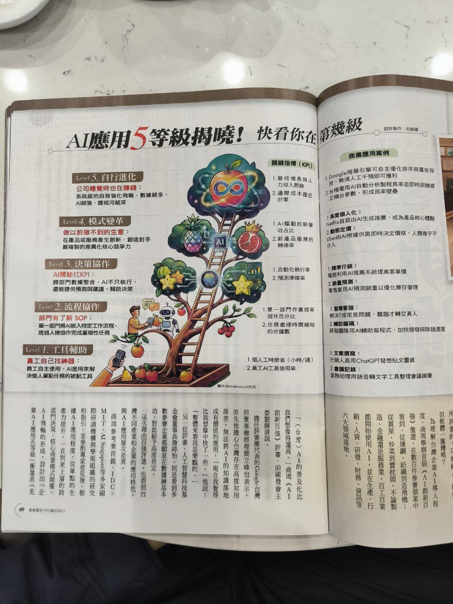

# 任務：編譯「LLM 技術與模型」知識 Wiki 頁

你是 SecondBrain 知識編譯器。以下是「LLM 技術與模型」主題下的 59 篇筆記摘要。
主題描述：LLM 模型比較、部署、微調、vLLM、量化、prompt engineering

## 要求

請根據以下筆記內容，產出一篇結構化的知識 Wiki 頁，格式如下：

```
---
title: "LLM 技術與模型 — 知識 Wiki"
date: 2026-04-26
type: wiki
content_layer: L3
topic: llm-tech
source_count: 59
last_compiled: 2026-04-26
_skip_sync: true
---

# {主題名稱} — 知識 Wiki

## 主題概述
(2-3 段，概括此主題的核心範圍、為何重要、目前發展階段)

## 核心概念
(列出 5-10 個核心概念，每個用 ### 小節，2-3 句說明 + Wiki Link 引用來源筆記)

## 關鍵發現
(從筆記中提煉的重要洞見，每條用 > blockquote + 來源 Wiki Link)

## 跨筆記關聯
(不同筆記之間的連結、矛盾、演進關係)

## 待探索方向
(筆記中提到但尚未深入的議題，供未來研究)
```

## 引用規則

- 每個段落都必須用 `[[note-filename]]` 或 `[[note-filename|顯示名稱]]` Wiki Link 引用來源筆記
- filename 就是下方每篇筆記的 `filename` 欄位（不含 .md）
- 不要虛構不存在的筆記名稱

---

## 筆記清單（共 59 篇）

### [1/59] AI 應用架構發展趨勢 v2 — Anthropic 主導的七層 stack 與課程敘事整合
- **filename**: `2026-04-25-AI七層架構與Anthropic主導趨勢`
- **path**: `tech/ai-ml/2026-04-25-AI七層架構與Anthropic主導趨勢.md`
- **date**: 2026-04-25
- **category**: tech/ai-ml
- **tags**: AI架構, agent-stack, anthropic-standard, MCP, SKILL.md, AGENTS.md, ECC, Google-Skills, harness-engineering, 課程敘事, 七層架構

**內容摘要：**

# AI 應用架構發展趨勢 v2 — 七層 stack 與 Anthropic 主導趨勢

## 📌 摘要

2026 年 AI 應用架構正在分層化，形成七層 stack（L1 模型 → L7 應用）。**最關鍵的洞察**：L1–L5 五層的核心標準幾乎都是 Anthropic 定義的開放規範（MCP、SKILL.md、AGENTS.md、CLAUDE.md、harness engineering），業界正在跟進採用，Google Cloud Next 2026 公開承認用 Anthropic 的 SKILL.md 格式。L6–L7 是這套基建之上長出來的應用層。對個人 skill pack、企業培訓、學術論文工作流而言，**選擇 Anthropic 開放標準 = 選擇跨平台未來相容**。

## 🔑 關鍵要點

1. **七層 stack 採呼叫鏈視角**（OSI-style）：L7 應用 → L6 平台 → L5 Agent 身份 → L4 Skills 能力 → L3 框架 → L2 協議 → L1 模型
2. **Anthropic 主導 L1–L5**：MCP（L2）、Cla
(...截斷)

---

### [2/59] DesignClaw ComfyUI 整合架構
- **filename**: `2026-04-04_DesignClaw-ComfyUI整合架構`
- **path**: `dispatch-outputs/2026-04-04_DesignClaw-ComfyUI整合架構.md`
- **date**: 2026-04-04
- **category**: tech/ai-ml
- **tags**: DesignClaw, ComfyUI, SDXL, ControlNet, Render-Agent, 室內設計, AI渲染

**內容摘要：**

# DesignClaw ComfyUI 整合架構

## 摘要

DesignClaw 的 Render Agent 層已完成實作，透過 ComfyUI REST API + WebSocket 將 SDXL RealVisXL V5.0 整合進室內設計渲染流水線。支援 dual ControlNet（Canny 結構線 + Depth 空間感）與可選的 IP-Adapter 風格轉移，針對六種日式簡約空間類型各自調校 prompt 和參數。目標部署機器為 ac-3090（RTX 3090, 24GB VRAM）。

---

## 1. 完整架構：ComfyUI 整合到 DesignClaw Render Agent

```
DesignClaw Pipeline
───────────────────────────────────────────────────────────
平面圖輸入（JPG/PNG）
    │
    ▼
[Render Agent — render_agent.py]
    │  ├── 載入 workflow template (japanes
(...截斷)

---

### [3/59] ComfyUI 室內設計渲染技術規劃
- **filename**: `2026-04-04_ComfyUI室內設計渲染技術規劃`
- **path**: `dispatch-outputs/2026-04-04_ComfyUI室內設計渲染技術規劃.md`
- **date**: 2026-04-04
- **category**: tech/ai-ml
- **tags**: ComfyUI, Stable-Diffusion, SDXL, ControlNet, 室內設計, AI渲染, DesignClaw, IP-Adapter, LoRA, prompt-engineering

**內容摘要：**

# ComfyUI 室內設計渲染技術規劃

**DesignClaw Render Agent 整合方案**
**硬體環境：** NVIDIA RTX 3090 (24GB VRAM)
**日期：** 2026-04-04

---

## 摘要

本文件規劃 DesignClaw 自動化管線中 Render Agent 的技術實作方案，以 ComfyUI 作為核心渲染引擎，整合 SDXL base model、Dual ControlNet（floor plan 空間約束）、IP-Adapter（風格遷移）和日式簡約風格 prompt engineering，在 RTX 3090 24GB VRAM 環境下實現 6 房間批量渲染（預估 3.5–5 分鐘），輸出至少 1024×1024 的寫實室內設計渲染圖。

---

## 1. 最適合室內設計的 Model 組合

### 1.1 Base Model 選擇：SDXL vs Flux vs SD 1.5

| 特性 | SD 1.5 | SDXL | Flux.1-dev |
|------|--------|------|---
(...截斷)

---

### [4/59] claude-token-efficient — 9 行 CLAUDE.md 減少 63% 輸出 token
- **filename**: `2026-04-03_Claude-Token-Efficient-CLAUDE-md`
- **path**: `dispatch-outputs/2026-04-03_Claude-Token-Efficient-CLAUDE-md.md`
- **date**: 2026-04-03
- **category**: tech/tools
- **tags**: Claude-Code, token優化, CLAUDE.md, prompt工程, 成本控制

**內容摘要：**

# claude-token-efficient — 9 行 CLAUDE.md 減少 63% 輸出 token

## 摘要

drona23/claude-token-efficient 是一個只有 9 行的 CLAUDE.md 檔案，丟進專案根目錄即可生效，透過禁止 Claude Code 的拍馬屁開頭、空洞結尾、重複問題、未被要求的建議等行為，聲稱可減少輸出 token 63%。1,900+ stars。實際效果取決於使用場景，重度使用者（日均 100+ prompt）才有明顯省錢效果。

## 背景

Claude Code 預設行為傾向冗長——每次回覆都帶 "Sure! Great question!" 開頭、"hope this helps!" 結尾、重述使用者問題、加入未被要求的建議。這些行為在單次對話中只是小麻煩，但在重度開發場景下（一天跑上百個 prompt），累積的 token 成本非常可觀。

## 分析內容

### 核心指令（9 行 CLAUDE.md）

```markdown
- Think before acting. Read existing fi
(...截斷)

---

### [5/59] AI 室內設計協作管線 — 開源資源與實作案例研究
- **filename**: `2026-04-03_AI室內設計管線開源資源研究`
- **path**: `dispatch-outputs/2026-04-03_AI室內設計管線開源資源研究.md`
- **date**: 2026-04-03
- **category**: tech/ai-ml
- **tags**: AI室內設計, react-planner, FreeCAD, BonsaiBIM, IfcOpenShell, IFC, Blender, 3D建模, BIM

**內容摘要：**

# AI 室內設計協作管線 — 開源資源與實作案例研究

## 摘要

針對「sketch → AI Vision → JSON → react-planner 2D → SketchUp/FreeCAD → D5/Blender → IFC/SKP/GLB → Notion + Google Drive」這條 AI 室內設計管線，完整調查 30+ 個開源工具和成功案例。核心發現：目前不存在端到端的開源 AI 室內設計管線，但每個環節都有可用的開源工具。最大挑戰是 D5 Render 無法自動化（無 API/CLI），需改用 Blender + Cycles 作為自動化渲染方案。

## 背景

室內設計產業的數位化流程仍高度依賴手動操作和商業軟體。這份研究是為了評估用開源工具建構 AI 協作管線的可行性，找出每個環節最佳的開源選項，並識別關鍵缺口。

## 分析內容

### 管線各階段工具對照

| 管線階段 | 推薦工具 | 替代方案 | 自動化程度 |
|---------|---------|---------|-----------|
| AI Vision → JSON 
(...截斷)

---

### [6/59] 知識管理架構比較：LLM Knowledge Base vs SecondBrain → Notion
- **filename**: `knowledge-management-comparison`
- **path**: `dispatch-outputs/knowledge-management-comparison.md`
- **date**: 2026-04-03
- **category**: tech-analysis
- **tags**: knowledge-management, LLM, Obsidian, Notion, SecondBrain, Karpathy

**內容摘要：**

# 知識管理架構比較分析：LLM Knowledge Base vs SecondBrain → Notion 管線

> 分析對象：Alan Chen｜悠識數位 AI 工具實戰專家
> 分析日期：2026-04-03

---

## 一、架構差異：兩種截然不同的知識哲學

這兩套系統表面上都是「把文章變成可檢索的知識庫」，但背後的設計哲學完全不同。理解這個差異，才能做出正確的架構決策。

### 方法 A：LLM Knowledge Base（Karpathy 式）

核心理念是**讓 LLM 成為知識的編譯器**。原始文章是 source code，LLM 負責 compile 成結構化的 wiki，就像 compiler 把 C 編譯成機器碼一樣。人類讀的是編譯後的產物，不是原始輸入。

資料流：`raw/*.md → LLM 編譯 → structured wiki/*.md → Obsidian 閱讀`

這裡有個關鍵的架構決策：知識的結構不是人手動定義的，而是 LLM 根據內容自動湧現的。索引、分類、交叉引用都是 LLM 在理解內容後產生的。這意味著知識結構會隨著內容演化
(...截斷)

---

### [7/59] DesignClaw — AI 室內裝修全自動管線系統計畫
- **filename**: `2026-04-03_DesignClaw室內裝修自動化系統計畫`
- **path**: `dispatch-outputs/2026-04-03_DesignClaw室內裝修自動化系統計畫.md`
- **date**: 2026-04-03
- **category**: tech/ai-ml
- **tags**: DesignClaw, 室內設計, OpenCode, MetaClaw, 多代理, BIM, IFC, 自動化管線, AI-Agent

**內容摘要：**

# DesignClaw — AI 室內裝修全自動管線系統計畫

## 一、系統定位

DesignClaw 是一套以 OpenCode Agent 為底層運行時、參考 MetaClaw 自進化架構設計的 AI 室內裝修全自動協作管線。每個設計環節由專屬 Agent 負責，Agent 之間透過事件驅動的訊息系統串接，形成從「手繪草稿」到「施工交付」的端對端自動化流程。

核心理念：**把 MetaClaw 的「Claw」（抓取 → 學習 → 進化）模式套用到室內設計產業的每一個環節。**

---

## 二、架構總覽

### 2.1 三層架構

```
┌─────────────────────────────────────────────────────────┐
│                    Layer 3: 業務層                        │
│  Notion（專案 UI）+ Google Drive（檔案倉庫）+ Web 檢視器   │
└────────────────────────┬───────────────────────
(...截斷)

---

### [8/59] Claude Code 會計三表案例分析 — AI 落地專業領域的實戰拆解
- **filename**: `2026-04-01_Claude-Code會計三表案例分析`
- **path**: `dispatch-outputs/2026-04-01_Claude-Code會計三表案例分析.md`
- **date**: 2026-04-01
- **category**: tech/ai-ml
- **tags**: Claude-Code, 會計三表, skill, subagent, 紅隊演練, 台灣稅務, vibe-coding

**內容摘要：**

# Claude Code 會計三表案例分析

## 摘要

用 Claude Code 在 3 小時內從散落的 PDF、Excel、銀行對帳單和收據截圖，產出完整的會計三表（損益表、資產負債表、現金流量表），通過會計師查帳。這個案例展示了 AI 落地到專業領域的完整方法論：自建 skill 注入領域知識 → 分輪次處理不同資料源 → 互動式補齊缺失資訊 → subagent 紅隊演練品質把關。

## 背景

連鎖餐飲業加盟主隔天會計要來查帳，需要快速產出會計三表。靈感來自日本稅務師畠山謙人用 Claude Code 一個人服務 60 家顧問公司的案例。

## 分析內容

### 工作流程拆解

整個流程分為五個階段，每個階段都有明確的方法論意義：

#### 階段一：自建領域 Skill（/taiwan-tax）

**做了什麼：** 搜尋 GitHub 沒有現成台灣會計工具，於是自己寫了一個 Claude Code skill，包含：
- 台灣會計科目對應規則
- 含稅未稅轉換公式
- 401 營業稅雙月申報邏輯
- 哪些可以自動化、哪些不能

**方法論意義：** 這是整個案
(...截斷)

---

### [9/59] Cisco AI Agent 五步驟 vs 會計三表五步法 — 方法論對照與應用
- **filename**: `2026-04-01_Cisco五步驟vs會計三表五步法對照分析`
- **path**: `dispatch-outputs/2026-04-01_Cisco五步驟vs會計三表五步法對照分析.md`
- **date**: 2026-04-01
- **category**: tech/ai-ml
- **tags**: AI-Agent, Cisco, 方法論, skill, Claude-Code, 框架設計

**內容摘要：**

# Cisco AI Agent 五步驟 vs 會計三表五步法 — 方法論對照與應用

## 摘要

思科首席工程師 Yuri Kramarz 提出的 AI Agent 五步驟框架，與從會計三表案例中歸納的五步法，本質上在解決同一個問題：如何讓 AI 從「偶爾能用」變成「穩定可靠」。兩套方法論高度互補——Cisco 偏向「設計時」的架構規範，會計五步法偏向「執行時」的工作流程。合併使用可以形成完整的 AI Agent 落地方法論。

## 背景

思科官網由首席工程師 Yuri Kramarz 撰寫的文章指出：AI 代理不是更聰明的 AI，而是一套可以被設計、拆解與優化的思考與行動流程。最多人卡關在第二步——劃清邊界。

## 分析內容

### Cisco 五步驟框架

| 步驟 | 核心概念 | 重點 |
|------|---------|------|
| 1. 身份定位 | 給 AI Agent 清晰的功能定位 | 不是擬人化，而是明確目的和判斷標準 |
| 2. 劃清邊界 ⭐ | 定義「不該做什麼」 | **最多人卡關處**——沒有邊界的 AI 會自行擴張任務範疇 |
| 
(...截斷)

---

### [10/59] 黃仁勳 × Lex Fridman Podcast
- **filename**: `2026-03-31_黃仁勳Lex-Fridman三個觀點`
- **path**: `dispatch-outputs/2026-03-31_黃仁勳Lex-Fridman三個觀點.md`
- **date**: 2026-03-31
- **category**: tech/ai-ml
- **tags**: 黃仁勳, NVIDIA, AI趨勢, Lex-Fridman, podcast, 職業轉型

**內容摘要：**

# 黃仁勳 × Lex Fridman Podcast #494 — 三個關鍵觀點摘要

## 摘要

NVIDIA 執行長黃仁勳上 Lex Fridman Podcast 第 494 集，兩個半小時的對話涵蓋晶片、供應鏈、台積電、AGI 定義等主題。其中三段與一般人最相關的觀點：AI 沒有取代放射科醫師反而讓需求增加、未來寫程式的人將從三千萬變十億、智慧正在商品化但判斷力無法被商品化。三個觀點指向同一個結論：AI 取代的是任務，不是職業。

## 背景

- **節目：** Lex Fridman Podcast #494
- **來賓：** Jensen Huang（黃仁勳），NVIDIA 創辦人暨執行長
- **時長：** 約 2 小時 30 分鐘
- **YouTube：** [Jensen Huang: NVIDIA - The $4 Trillion Company & the AI Revolution](https://lexfridman.com/jensen-huang/)
- **完整逐字稿：** [lexfridman.com/jensen-huang-tran
(...截斷)

---

### [11/59] Claude Code 源碼洩漏分析 — 51.2 萬行 TypeScript 揭示的架構秘密
- **filename**: `2026-03-31_Claude-Code源碼洩漏分析`
- **path**: `dispatch-outputs/2026-03-31_Claude-Code源碼洩漏分析.md`
- **date**: 2026-03-31
- **category**: tech/ai-ml
- **tags**: Claude-Code, Anthropic, 源碼分析, KAIROS, multi-agent, 架構設計

**內容摘要：**

# Claude Code 源碼洩漏分析

## 摘要

Anthropic 的 Claude Code CLI 工具因為 npm 套件中包含了 sourcemap 檔案（cli.js.map），被安全研究員透過逆向工程還原出完整 TypeScript 源碼，共約 1,900 個檔案、512,000 行程式碼。ChinaSiro/claude-code-sourcemap 是其中一個還原版本（v2.1.88）。源碼揭示了多個尚未公開的功能：KAIROS（常駐背景 Agent）、ULTRAPLAN（30 分鐘遠端規劃）、Coordinator 多 Agent 協調模式、Buddy 伴侶 UI、Agent Swarm 等。

## 背景

- **發現時間：** 2026 年 3 月 31 日
- **發現者：** 安全研究員 Chaofan Shou
- **來源：** npm 套件 `@anthropic-ai/claude-code` v2.1.88 中的 `cli.js.map`
- **還原方式：** 提取 sourcemap 的 `sourcesContent` 欄位
- **
(...截斷)

---

### [12/59] MetaClaw 框架分析 — 自進化 AI Agent 整合方案
- **filename**: `2026-03-30_MetaClaw框架分析`
- **path**: `dispatch-outputs/2026-03-30_MetaClaw框架分析.md`
- **date**: 2026-03-30
- **category**: tech/ai-ml
- **tags**: MetaClaw, AI-Agent, RL, 透明代理, vibe-coding, 工具整合

**內容摘要：**

# MetaClaw 框架分析 — 整合與利用方案

> 針對悠識數位現有工具鏈（Claude Code / Cursor / Antigravity）的整合評估

---

## 一、MetaClaw 是什麼

MetaClaw 是北卡羅來納大學 AIMING Lab 開發的開源 AI Agent 框架。核心概念：在你和 LLM 之間插入一個「透明代理」(transparent proxy)，讓 AI Agent 能夠自我進化——你每次跟它互動，它都在學。

最有趣的設計：它會看你的 Google Calendar，發現你在開會時，就自動開始用閒置的運算資源訓練模型。你開會的時間 = AI 進化的時間。

**GitHub:** [aiming-lab/MetaClaw](https://github.com/aiming-lab/MetaClaw)
**論文:** [arXiv:2603.17187](https://arxiv.org/abs/2603.17187)

---

## 二、技術架構

### 2.1 透明代理架構

```
你的工具（Claude Code / C
(...截斷)

---

### [13/59] 悠識數位 RAG 知識檢索系統 — 完整實作規劃
- **filename**: `2026-03-30_悠識RAG系統規劃`
- **path**: `dispatch-outputs/2026-03-30_悠識RAG系統規劃.md`
- **date**: 2026-03-30
- **category**: tech/ai-ml
- **tags**: RAG, Qdrant, 知識管理, 向量資料庫, FastAPI, 悠識數位

**內容摘要：**

# 悠識數位 RAG 知識檢索系統 — 完整實作規劃

> 基於 Alan 的 MVP 架構，擴展為可部署、可擴展的內部知識管理系統

---

## 一、系統架構總覽

```
┌─────────────────────────────────────────────────────────┐
│                    使用者介面 (Web)                        │
│  ┌──────────┐  ┌──────────┐  ┌────────────────────┐     │
│  │ 部門篩選  │  │ 搜尋輸入  │  │  結果展示 + 預覽    │     │
│  └──────────┘  └──────────┘  └────────────────────┘     │
└────────────────────────┬────────────────────────────────┘
                         │ HTTP API
┌────────────────────────▼─
(...截斷)

---

### [14/59] FDE 角色解析與 Smart4A 2026 轉型分析
- **filename**: `2026-03-30_FDE角色與Smart4A轉型分析`
- **path**: `dispatch-outputs/2026-03-30_FDE角色與Smart4A轉型分析.md`
- **date**: 2026-03-30
- **category**: tech/ai-ml
- **tags**: FDE, Forward-Deployed-Engineer, AI培訓, Smart4A, Palantir, 架構師

**內容摘要：**

# FDE 角色解析與 Smart4A 2026 轉型分析

## 摘要

Forward Deployed Engineer（FDE）由 Palantir 於 2010 年代初期創造，2025 年因 OpenAI 等公司大規模招募而爆紅（職缺年增 800%）。Smart4A 2026 以 FDE 架構師思維重新定位課程方向，從工具教學轉向企業級 AI 落地能力培養。本文分析 FDE 的起源、核心能力模型，以及 Smart4A 轉型的定位策略。

## 背景

Smart4A Team 宣布 2026 年課程全面轉型，不再以工具教學為核心，改以 FDE（Forward Deployed Engineer）架構師培訓為學習框架，主打培養能在企業裡獨當一面的 AI 實戰架構師。

## 分析內容

### FDE 的起源與定義

FDE 最早由 Palantir 在 2010 年代初期創造，內部代號「Deltas」。核心做法是把工程師直接派駐到客戶現場（早期主要是美國政府機構），深入理解客戶問題後親手建置解決方案。Palantir 在 2016 年前 FDE 人數甚至超過一般軟體工程師。

(...截斷)

---

### [15/59] ClaudeBot - 透過 Telegram 打造的行動 AI 開發環境
- **filename**: `2026-03-06-ClaudeBot-Telegram-AI-IDE`
- **path**: `tech/tools/2026-03-06-ClaudeBot-Telegram-AI-IDE.md`
- **date**: 2026-03-06
- **category**: tech/tools
- **tags**: Claude, Telegram, Bot, AI-IDE, 遠端開發, MCP, 語音轉文字

**內容摘要：**

# ClaudeBot - 透過 Telegram 打造的行動 AI 開發環境

## 📊 元資訊
- **難度**：⭐⭐⭐⭐
- **來源類型**：開源專案 + 社群分享
- **作者**：Jeffrey0117
- **筆記時間**：2026-03-06 11:02

## 📌 摘要
ClaudeBot 是一個透過 Telegram Bot 串接 Claude CLI 的開發工具，讓開發者可以用手機遠端控制 AI 編輯程式碼。不同於一般的聊天機器人包裝，它是完整的開發平台，支援即時串流、多層記憶系統、語音輸入、跨機器遠端協作等功能。作者表示透過這個工具已經產生超過 20 萬行實際使用的程式碼。

## 🏷️ 標籤分類
- **大分類**：tech
- **小分類**：tools
- **核心關鍵字**：Telegram Bot、Claude Code、AI IDE、遠端開發

## 🔑 關鍵要點

1. **從 VSCode 到 CLI 再到 Telegram 的演進**
   - VSCode 插件 → CLI + Windows Terminal 多分頁 → Telegram 
(...截斷)

---

### [16/59] 玩爆你的龍蝦 — 最強 OpenClaw 安裝設定應用實機演練
- **filename**: `2026-03-06-玩爆你的龍蝦-OpenClaw安裝設定應用實機演練`
- **path**: `tech/ai-ml/2026-03-06-玩爆你的龍蝦-OpenClaw安裝設定應用實機演練.md`
- **date**: 2026-03-06
- **category**: tech/ai-ml
- **tags**: OpenClaw, AI Agent, 技術書籍, 台灣原創, LINE Bot, Telegram, 多機協作

**內容摘要：**

# 玩爆你的龍蝦 — 最強 OpenClaw 安裝設定應用實機演練

## 📊 元資訊
- **難度**：⭐⭐⭐
- **來源類型**：新書預購公告
- **作者**：Alan Chen（本人）
- **筆記時間**：2026-03-06 10:11

## 📌 摘要
中文第一本 OpenClaw（龍蝦）專書在天瓏開始預購！從龍蝦發布到成書僅花 14 天，涵蓋完整安裝設定、LINE/Telegram 整合、多機協作 Nodes 架構等實戰內容。

## 🏷️ 標籤分類
- **大分類**：tech
- **小分類**：ai-ml

## 🔑 關鍵要點
1. **中文第一本 OpenClaw 專書**：填補繁體中文市場空白
2. **14 天閃電寫作**：從工具發布到成書的超高效率
3. **LINE 完整設定**：最多人詢問的整合教學
4. **多機協作 Nodes**：控制其他電腦、手機、平板的進階功能
5. **五章完整架構**：從概念理解到正式域名部署

## 💬 金句摘錄
> "從龍蝦一出來，馬上安裝在 Linux 中，然後第二天立即訂了 Mac Mini，第三天規劃書籍，第四
(...截斷)

---

### [17/59] Jensen Huang Morgan Stanley TMT 科技大會演講重點
- **filename**: `2026-03-06-jensen-huang-morgan-stanley-tmt`
- **path**: `tech/ai-ml/2026-03-06-jensen-huang-morgan-stanley-tmt.md`
- **date**: 2026-03-06
- **category**: tech/ai-ml
- **tags**: NVIDIA, Jensen Huang, AI Agent, 運算經濟學, 物理AI, GPU, Token經濟

**內容摘要：**

# Jensen Huang Morgan Stanley TMT 科技大會演講重點

## 📊 元資訊
- **難度**：⭐⭐⭐
- **來源類型**：科技大會演講
- **作者**：Jensen Huang (NVIDIA 執行長)
- **筆記時間**：2026-03-06 11:00

## 📌 摘要
NVIDIA 執行長黃仁勳在 Morgan Stanley TMT 科技大會上闡述 AI 產業的三次拐點（生成式 AI → 推理 → Agent），並提出「運算等於營收」的核心觀點。他預測軟體產業將從工具授權轉型為 Token 服務，同時揭示物理 AI 將是下一個十年的前沿領域。

## 🏷️ 標籤分類
- **大分類**：tech
- **小分類**：ai-ml

## 🔑 關鍵要點

### AI 三次拐點
1. **生成式 AI**：ChatGPT 讓 GPT-3 變得易用，開啟 AI 普及化
2. **推理能力**：o1 帶來自我反思和修正能力，運算量增加 1000 倍
3. **AI Agent**：提示詞從「查詢」變成「行動」，Token 消耗量再增 100 萬倍


(...截斷)

---

### [18/59] AI 圖片生成 - 真實照片風格提示詞指南
- **filename**: `2026-03-04-AI圖片生成-真實照片風格提示詞`
- **path**: `tech/ai-ml/2026-03-04-AI圖片生成-真實照片風格提示詞.md`
- **date**: 2026-03-04
- **category**: tech/ai-ml
- **tags**: AI圖片生成, Prompt工程, 攝影, Gemini, Midjourney, 紀實攝影

**內容摘要：**

# AI 圖片生成 - 真實照片風格提示詞指南

## 📊 元資訊
- **難度**：⭐⭐
- **來源類型**：社群實戰分享
- **筆記時間**：2026-03-04 17:32
- **適用模型**：Gemini、Midjourney、DALL-E、Stable Diffusion

## 📌 摘要
一套可直接使用的「真實照片風格」AI 圖片生成提示詞結構。核心概念：**紀實攝影感（documentary realism）＋ 微瑕疵細節 ＋ 自然光源**。真實感的關鍵不是「完美」，而是「不完美」。

## 🏷️ 標籤分類
- **大分類**：tech
- **小分類**：ai-ml
- **關鍵字**：AI 圖片生成、Prompt 工程、紀實攝影、真實感、Gemini

## 🔑 核心結構公式

```
主體 + 鏡頭描述 + 光線條件 + 細節紋理 + 色彩設定 + 拍攝器材感 + 排除修圖
```

## 📋 萬用模板

### 人像真實感模板
```
Extreme close-up portrait of [subject], three-quarter view, na
(...截斷)

---

### [19/59] AI Context Token 優化術 - 視覺化你的 Token 消耗
- **filename**: `2026-03-04-AI-Context-Token-優化術`
- **path**: `tech/ai-ml/2026-03-04-AI-Context-Token-優化術.md`
- **date**: 2026-03-04
- **category**: tech/ai-ml
- **tags**: AI, Token優化, 成本控制, Context管理, Prompt工程, Claude

**內容摘要：**

# AI Context Token 優化術 - 視覺化你的 Token 消耗

## 📊 元資訊
- **難度**：⭐⭐
- **來源類型**：社群實戰分享
- **筆記時間**：2026-03-04 17:30
- **適用對象**：使用 Claude Code、Cursor、Copilot 等 AI 助手的開發者

## 📌 摘要
透過建立 Token Dashboard 視覺化 context 檔案的 token 消耗，發現啟動時載入的 context 可從 13,190 tokens 壓縮至 6,673 tokens（約 50% 節省）。關鍵不是省錢，而是**你根本不知道問題存在，直到視覺化它**。

## 🏷️ 標籤分類
- **大分類**：tech
- **小分類**：ai-ml
- **關鍵字**：Token 優化、Context 管理、成本控制、視覺化、AI 助手

## 🔑 關鍵要點

### 1. 問題發現
- **每次啟動 AI 對話**都會載入大量 context 檔案
- 原作者發現啟動消耗 **13,190 tokens**
- 很多內容是「已經內化的規則
(...截斷)

---

### [20/59] 行銷人使用 Claude Code 實戰指南
- **filename**: `2026-03-04-行銷人使用claude-code實戰指南`
- **path**: `tech/ai-ml/2026-03-04-行銷人使用claude-code實戰指南.md`
- **date**: 2026-03-04
- **category**: tech/ai-ml
- **tags**: Claude Code, AI工具, 行銷自動化, 非工程師, 人機協作

**內容摘要：**

# 行銷人使用 Claude Code 實戰指南

## 📊 元資訊
- **難度**：⭐⭐
- **來源類型**：文章/心得分享
- **作者**：未知（行銷從業者）
- **筆記時間**：2026-03-04 08:52

## 📌 摘要
這是一篇針對非工程師背景的行銷人員，如何有效使用 Claude Code 的實戰指南。強調不需要精通程式碼，但需要理解基礎概念，並保持「人在迴路中」(Human-in-the-loop) 的工作模式。

## 🏷️ 標籤分類
- **大分類**：tech
- **小分類**：ai-ml

## 🔑 關鍵要點
1. **懂基礎不代表要會寫程式**：了解 HTML/CSS/JS 的角色、框架基礎、SEO 原理、部署概念
2. **Human-in-the-loop 原則**：AI 做苦差事（草稿、數據整理），人負責品牌語氣、策略決策、編輯判斷、創意方向
3. **請工程師把關**：涉及產品或面向用戶的改動，發布前必須請工程師 review
4. **自動化重複性工作**：定期報表、整理試算表、檢查排名等崩潰日常可以交給 AI
5. **誠實面對缺點*
(...截斷)

---

### [21/59] OpenClaw Agent 省錢實戰：三個玩家的第一線經驗
- **filename**: `2026-03-04-openclaw-agent-實戰經驗`
- **path**: `tech/ai-ml/2026-03-04-openclaw-agent-實戰經驗.md`
- **date**: 2026-03-04
- **category**: tech/ai-ml
- **tags**: OpenClaw, AI Agent, Heartbeat Protocol, OpenHome, SaaS, Mac Mini, Raspberry Pi

**內容摘要：**

# OpenClaw Agent 省錢實戰：三個玩家的第一線經驗

## 📊 元資訊
- **難度**：⭐⭐⭐
- **來源類型**：Podcast 節目整理
- **原節目**：This Week in Startups (TWIST)
- **主持人**：Jason Calacanis、Lon Harris
- **筆記時間**：2026-03-04 14:22

## 📌 摘要
三位 OpenClaw 玩家分享實戰經驗：非工程師用 Mac Mini 比雲端更易上手、Heartbeat Protocol 取代 Agile 站會、OpenHome 把 Agent 帶入智慧音箱、SaaS 定價模式正被 Agent 顛覆。

## 🏷️ 標籤分類
- **大分類**：tech
- **小分類**：ai-ml

## 🔑 關鍵要點

### 1. 本地硬體勝過雲端（給非工程師）
- Jordy Coltman 花了 80 小時和 $800 踩坑後的結論
- Mac Mini 能看到畫面、截圖 debug，體驗遠勝 AWS EC2 + Linux 終端機
- 「看不到在幹嘛」的焦慮感是真實的
(...截斷)

---

### [22/59] Claude Code Remote Control — 手機遠端操控 AI Coding Agent
- **filename**: `2026-03-01-claude-code-remote-control`
- **path**: `tech/tools/2026-03-01-claude-code-remote-control.md`
- **date**: 2026-03-01
- **category**: tech/tools
- **tags**: Claude, Claude Code, Anthropic, AI Agent, Remote Control, 開發工具

**內容摘要：**

# Claude Code Remote Control — 手機遠端操控 AI Coding Agent

## 📊 元資訊
- **難度**：⭐⭐
- **來源類型**：新聞/產品更新
- **作者**：未知
- **筆記時間**：2026-03-01 09:01

## 📌 摘要
Claude Code 推出 Remote Control 功能，讓使用者可以透過手機或瀏覽器遠端操控 CLI session。這解決了 AI coding agent 必須綁在終端機前的痛點，使用場景從桌面擴展到任何有手機的地方。

## 🏷️ 標籤分類
- **大分類**：tech
- **小分類**：tools

## 🔑 關鍵要點
1. **Remote Control 啟用方式**：在終端機輸入 `claude rc`，手機或瀏覽器即可接手 session
2. **端對端加密**：Anthropic 完全看不到使用者程式碼，滿足企業安全需求
3. **自動重連機制**：筆電闔上、網路斷線，session 不會中斷，恢復後自動接上
4. **多 session 支援**：手機 app 上可同時
(...截斷)

---

### [23/59] QwenASR Int8 量化：8GB RAM 筆電也能跑的語音辨識
- **filename**: `2026-03-01-QwenASR-int8-CPU語音辨識`
- **path**: `tech/ai-ml/2026-03-01-QwenASR-int8-CPU語音辨識.md`
- **date**: 2026-03-01
- **category**: tech/ai-ml
- **tags**: QwenASR, 語音辨識, 模型量化, Int8, CPU推論, VibeCoding

**內容摘要：**

# QwenASR Int8 量化：8GB RAM 筆電也能跑的語音辨識

## 📊 元資訊
- **難度**：⭐⭐⭐⭐
- **來源類型**：個人實作筆記
- **作者**：自己量化
- **筆記時間**：2026-03-01 09:11

## 📌 摘要
成功將 QwenASR 1.7B 模型量化至 Int8，讓 5 年前的 8GB RAM 小筆電也能運行語音辨識，速度約為音檔時長的 1/3（1 小時音檔 20 分鐘完成），比 Whisper 輕量且效果優於 0.6B 模型。

## 🏷️ 標籤分類
- **大分類**：tech
- **小分類**：ai-ml

## 🔑 關鍵要點
1. **QwenASR 1.7B Int8 量化版本**可在 CPU 上運作，只需 8GB RAM（不是 VRAM）
2. **辨識速度**：1 小時音檔約 20 分鐘完成（速度為時長的 1/3）
3. **EXE 版本**：雙點執行，自動下載模型，使用簡單
4. **量化策略**：Int8（非 4bit），效果接近原始權重，比 0.6B 好很多
5. **GPU 版本**：新增 Streamlit 
(...截斷)

---

### [24/59] Ethan Mollick 代理時代 AI 使用指南
- **filename**: `2026-03-01-ethan-mollick-agentic-era-ai-guide`
- **path**: `tech/ai-ml/2026-03-01-ethan-mollick-agentic-era-ai-guide.md`
- **date**: 2026-03-01
- **category**: tech/ai-ml
- **tags**: AI Agent, Claude, GPT, Gemini, 工作效率, 典範轉移

**內容摘要：**

# Ethan Mollick 代理時代 AI 使用指南

## 📊 元資訊
- **難度**：⭐⭐⭐
- **來源類型**：文章
- **作者**：Ethan Mollick（華頓商學院教授）
- **筆記時間**：2026-03-01 09:17

## 📌 摘要
Ethan Mollick 發布第八版 AI 使用指南，指出我們已正式進入「代理時代 (Agentic Era)」。他提出「模型、應用程式、AI 工作套件（Harness）」三大維度框架，強調從「提示工程」轉型為「管理者思維」的重要性，並建議透過付費方案與專業工作框架來極大化生產力。

## 🏷️ 標籤分類
- **大分類**：tech
- **小分類**：ai-ml

## 🔑 關鍵要點

### 1. 認知斷裂：AI 使用定義的根本改變
- 過去「使用 AI」= 在對話框裡聊天
- 現在「使用 AI」= 指派任務 (Assigning) 給能自主使用工具的 Agent
- 這是自 ChatGPT 發布以來最大的典範轉移

### 2. 三大構面框架
| 構面 | 說明 | 範例 |
|------|------|--
(...截斷)

---

### [25/59] AI 模型成本優化：用高階模型訓練低階模型的工作流
- **filename**: `2026-03-01-AI模型成本優化-用高階模型訓練低階模型`
- **path**: `tech/ai-ml/2026-03-01-AI模型成本優化-用高階模型訓練低階模型.md`
- **date**: 2026-03-01
- **category**: tech/ai-ml
- **tags**: AI成本優化, Claude, GPT-4o, Workflow設計, Skills, Memory, 模型降級

**內容摘要：**

# AI 模型成本優化：用高階模型訓練低階模型的工作流

## 📊 元資訊
- **難度**：⭐⭐⭐
- **來源類型**：個人實驗心得
- **作者**：Alan Chen
- **筆記時間**：2026-03-01 08:59

## 📌 摘要
重複性任務不需要每次都用昂貴的大腦（如 Claude Opus）。實驗發現：用高階模型（GitHub Copilot + Claude Opus 4.6）將訓練過程中產生的 memory 固化成 web services 和 skills，之後即可用免費模型（GPT-4o）穩定執行相同任務。

## 🏷️ 標籤分類
- **大分類**：tech
- **小分類**：ai-ml

## 🔑 關鍵要點
1. **成本意識**：重複任務不需要每次都用高價模型（如 Claude Opus/Sonnet）
2. **兩階段工作流**：
   - 第一階段：用高階模型（Claude Opus 4.6）+ GitHub Copilot 訓練和產生 memory
   - 第二階段：將 memory 固化為 web services + skills
3.
(...截斷)

---

### [26/59] WFGY RAG 16 問題清單 - 語義防火牆診斷框架
- **filename**: `2026-03-01-WFGY-RAG-16問題清單`
- **path**: `tech/ai-ml/2026-03-01-WFGY-RAG-16問題清單.md`
- **date**: 2026-03-01
- **category**: tech/ai-ml
- **tags**: RAG, LLM, 除錯, Agent, 語義防火牆, 向量資料庫, 幻覺問題

**內容摘要：**

# WFGY RAG 16 問題清單 - 語義防火牆診斷框架

## 📊 元資訊
- **難度**：⭐⭐⭐⭐
- **來源類型**：開源專案 / 技術文件
- **作者**：阿紫BigBig (onestardao)
- **授權**：MIT License
- **GitHub Stars**：1.5k+
- **筆記時間**：2026-03-01 09:09

## 📌 摘要
WFGY Problem Map 是一份開源的 RAG/Agent 系統診斷框架，定義了 16 種可重現的 AI 故障模式及其修復方法。核心概念是「語義防火牆」(Semantic Firewall)——在生成輸出之前檢查系統狀態，而非在輸出後打補丁。這份清單已被 RAGFlow、LlamaIndex、哈佛 MIMS Lab 等主流框架和學術單位收錄。

## 🏷️ 標籤分類
- **大分類**：tech
- **小分類**：ai-ml
- **應用場景**：RAG 系統、Agent 開發、LLM 應用除錯

## 🔑 關鍵要點

### 核心理念：語義防火牆
1. **傳統方式**：輸出後偵測錯誤 → 手動打
(...截斷)

---

### [27/59] AI Skill 時代來臨：律師實務應用案例
- **filename**: `2026-03-01-AI-skill-時代來臨-律師實務應用案例`
- **path**: `tech/ai-ml/2026-03-01-AI-skill-時代來臨-律師實務應用案例.md`
- **date**: 2026-03-01
- **category**: tech/ai-ml
- **tags**: AI應用, Skill, Agent, 法律科技, Claude, 專業服務, 判斷力, 通用AI

**內容摘要：**

# AI Skill 時代來臨：律師實務應用案例

## 📊 元資訊
- **難度**：⭐⭐⭐⭐
- **來源類型**：文章/心得分析
- **作者**：轉述者分析 + Zack Shapiro（小型律師事務所共同創辦人）
- **筆記時間**：2026-03-01 08:33

## 📌 摘要
2026 年 AI 應用的核心已從「Prompt」轉向「Skill」。Skill 是可系統化迭代的知識封裝，驅動 Agent 分工協作。律師 Zack Shapiro 分享如何用通用型 AI（Claude）而非專門法律 AI 產品，以兩人精品事務所的規模對抗大型律所，關鍵在於將個人十年實務判斷力編碼為 AI 技能。

## 🏷️ 標籤分類
- **大分類**：tech
- **小分類**：ai-ml

## 🔑 關鍵要點
1. **從 Prompt 到 Skill**：2026 年 AI 顯學不再是 prompt，而是可被系統化迭代更新的 Skill
2. **Skill 驅動 Agent**：Agent 之所以有別，主要因為掌握的 Skill 不同（發想/撰寫/校驗）
3. **人類角色轉變
(...截斷)

---

### [28/59] Claude 桌面應用程式法律實務工作流程
- **filename**: `2026-03-01-claude-desktop-lawyer-workflow`
- **path**: `tech/ai-ml/2026-03-01-claude-desktop-lawyer-workflow.md`
- **date**: 2026-03-01
- **category**: tech/ai-ml
- **tags**: Claude, LegalTech, AI工作流, 提示工程, 律師, 自動化

**內容摘要：**

# Claude 桌面應用程式法律實務工作流程

## 📊 元資訊
- **難度**：⭐⭐⭐
- **來源類型**：專業經驗分享文章
- **作者**：法律從業者（兩人事務所經營者）
- **筆記時間**：2026-03-01 08:36

## 📌 摘要
一位律師分享如何運用 Claude 桌面應用程式的三種模式（Chat、Cowork、Code）徹底改變法律實務工作。透過自訂「技能」系統，將多年專業判斷編碼成可複用的指令文件，讓兩人事務所能處理大型事務所的工作量。

## 🏷️ 標籤分類
- **大分類**：tech
- **小分類**：ai-ml
- **延伸分類**：LegalTech、工作流程自動化

## 🔑 關鍵要點

### Claude 桌面版三種模式
1. **Chat（對話）**：像與初級律師交談，分析問題、構思策略、草擬文件
2. **Cowork（協作）**：指向資料夾後自主執行任務，讀取/創建/編輯文件（對實務影響最大）
3. **Code（程式碼）**：建立自訂工具，如法律文件轉語音音訊

### 六大核心技能
1. 合約審查（四種模式、嚴重程度評等、缺失
(...截斷)

---

### [29/59] AI Agent 正在變成基礎設施：六大發展路線分析
- **filename**: `2026-03-01-ai-agent-infrastructure-trend`
- **path**: `tech/ai-ml/2026-03-01-ai-agent-infrastructure-trend.md`
- **date**: 2026-03-01
- **category**: tech/ai-ml
- **tags**: AI Agent, 基礎設施, Multi-Agent, Coding Agent, Agent OS, 趨勢分析

**內容摘要：**

# AI Agent 正在變成基礎設施：六大發展路線分析

## 📊 元資訊
- **難度**：⭐⭐⭐⭐
- **來源類型**：產業趨勢分析文章
- **作者**：未知（產業觀察者）
- **筆記時間**：2026-03-01 09:22

## 📌 摘要
這篇文章系統性地整理了近期 AI Agent 的發展趨勢，歸納出六條清晰的發展路線。作者認為 Agent 正在從單點功能演進為「工作系統」，最終將成為基礎設施層級的存在。這是一篇非常有價值的產業地圖式分析。

## 🏷️ 標籤分類
- **大分類**：tech
- **小分類**：ai-ml

## 🔑 關鍵要點

### 六大發展路線

1. **瀏覽器與 IDE 成為 Agent 的身體**
   - Google Auto Browse 整合進 Chrome
   - Apple 將 Claude Agent SDK 整合進 Xcode
   - IDE 從編輯器變成「agent-native 開發環境」

2. **Agent 管理平台出現（Agent OS 雛形）**
   - OpenAI Frontier 涵蓋：sha
(...截斷)

---

### [30/59] WiFi DensePose：無需攝影機的 WiFi 人體姿態追蹤系統
- **filename**: `2026-03-01-WiFi-DensePose-開源人體姿態追蹤`
- **path**: `tech/ai-ml/2026-03-01-WiFi-DensePose-開源人體姿態追蹤.md`
- **date**: 2026-03-01
- **category**: tech/ai-ml
- **tags**: WiFi, CSI, 人體姿態追蹤, 電腦視覺, 開源專案, MIT授權, 隱私保護, 即時偵測

**內容摘要：**

# WiFi DensePose：無需攝影機的 WiFi 人體姿態追蹤系統

## 📊 元資訊
- **難度**：⭐⭐⭐⭐
- **來源類型**：技術新聞 / 開源專案
- **作者**：Reuven Cohen
- **筆記時間**：2026-03-01 08:57

## 📌 摘要
WiFi DensePose 是一個突破性的開源專案，利用普通 WiFi 路由器的 Channel State Information (CSI) 訊號，無需攝影機即可即時追蹤人體姿態，並能穿透牆壁進行偵測。系統達到 94.2% 姿態偵測準確率和 96.5% 跌倒偵測靈敏度，延遲低於 50 毫秒，支援同時追蹤 10 人。

## 🏷️ 標籤分類
- **大分類**：tech
- **小分類**：ai-ml
- **技術領域**：電腦視覺、訊號處理、人體姿態估計
- **應用領域**：醫療保健、智慧家居、健身、安全監控

## 🔑 關鍵要點

1. **突破性技術**：使用 WiFi CSI 訊號取代攝影機進行人體姿態追蹤，可穿透牆壁運作
2. **高效能表現**：姿態偵測準確率 94.2%、跌倒偵測靈敏
(...截斷)

---

### [31/59] AI 時代的教育系統級創新：從職場能力斷層到個性化教育
- **filename**: `2026-02-10-AI時代教育系統級創新`
- **path**: `tech/ai-ml/2026-02-10-AI時代教育系統級創新.md`
- **date**: 2026-02-10
- **category**: tech/ai-ml
- **tags**: AI, 教育創新, 個性化教育, 走班制, 青春期教育, 李希貴

**內容摘要：**

# AI 時代的教育系統級創新：從職場能力斷層到個性化教育

## 📊 元資訊
- **難度**：⭐⭐⭐
- **來源類型**：音頻文稿/文章
- **作者**：李南南（得到頭條）
- **筆記時間**：2026-02-10 21:51

## 📌 摘要
在 AI 衝擊下，職場「老帶新」的傳承模式正在消失，社會的「大學功能」弱化。學校需要成為「社會的濃縮」，提前培養學生人之為人的優勢。這需要個性化教育，而走班制是降低邊際成本的關鍵方式。對青春期學生而言，教育首先是關係學。

## 🏷️ 標籤分類
- **大分類**：tech
- **小分類**：ai-ml（AI 對社會的影響）

## 🔑 關鍵要點

### 1. AI 造成職場能力斷層
- 過去：老員工帶新人，技能代代相傳
- 現在：資深員工用 AI 打下手，不再帶新人
- 結果：新人在職場的學習期正在消失，社會的「大學功能」弱化

### 2. 學校需要成為「社會的濃縮」
- 李希貴校長觀點：讓學生在學校先「活一遍」
- 把社會化過程前置到中學階段
- 學校要盡早發現學生的禀賦和特長

### 3. 個性化教育的邊際成本問題
- 
(...截斷)

---

### [32/59] Everything Claude Code - Anthropic Hackathon 獲勝專案
- **filename**: `everything-claude-code`
- **path**: `tech/ai-ml/everything-claude-code.md`
- **date**: 2026-02-06
- **category**: tech/ai-ml
- **tags**: claude, anthropic, hackathon, claude-code, skills, agents

**內容摘要：**

# Everything Claude Code - Anthropic Hackathon 獲勝專案

## 摘要

這是一個在 Anthropic x Forum Ventures Hackathon (NYC) 中獲勝的開源專案，包含完整的 Claude Code 配置集合。作者團隊在 8 小時內用 Claude Code 建立了 zenith.chat，贏得 $15,000 API credits。

## 專案資訊

- **GitHub**: https://github.com/affaan-m/everything-claude-code
- **作者**: Affaan Mustafa 和團隊
- **授權**: MIT License
- **Hackathon**: Anthropic x Forum Ventures (NYC)
- **獎勵**: $15,000 API credits
- **成就**: 8 小時內建立 zenith.chat

## 專案規模

經過 10+ 個月密集日常使用驗證：

- **15+ agents**（專業代理）
- **3
(...截斷)

---

### [33/59] OpenClaw 與 AI Agent 新時代:從寫程式到定義規章的典範轉移
- **filename**: `2026-02-06-OpenClaw-AI-Agent-新時代思考`
- **path**: `tech/ai-ml/2026-02-06-OpenClaw-AI-Agent-新時代思考.md`
- **date**: 2026-02-06
- **category**: tech/ai-ml
- **tags**: OpenClaw, AI-Agent, 第一性原理, MECE, 系統工程, 硬體需求

**內容摘要：**

# OpenClaw 與 AI Agent 新時代:從寫程式到定義規章的典範轉移

## 📊 元資訊
- **難度**:⭐⭐⭐⭐
- **來源類型**:個人洞察
- **作者**:Alan Chen
- **筆記時間**:2026-02-06 20:19

## 📌 摘要
OpenClaw 的出現標誌著我們從「寫程式」時代進入「定義規章」時代。真正的核心戰場不再是程式碼,而是在 agents.md 與 skills.md 這兩份檔案中定義 AI Agent 的行為規章、權限邊界與應變邏輯。這是一場從程式設計師到系統工程師的身份轉變。

## 🏷️ 標籤分類
- **大分類**:tech
- **小分類**:ai-ml
- **關鍵概念**:AI Agent、第一性原理、MECE、系統工程

## 🔑 關鍵要點

### 1. 數位樂高:程式碼的「極小化」
- OpenClaw 的架構將本機程式碼需求縮減到極致
- 戰場轉移:從 Debug 轉向設計產品邏輯藍圖
- **核心轉變**:不再是「刻」功能,而是「定義」章程
- 兩大關鍵檔案:**agents.md** 與 **skills.
(...截斷)

---

### [34/59] AI 產業年末三大趨勢：技術分化、資本分化、賭注極端化
- **filename**: `2026-02-04-AI產業年末三大趨勢-技術分化-資本分化-賭注極端化`
- **path**: `tech/ai-ml/2026-02-04-AI產業年末三大趨勢-技術分化-資本分化-賭注極端化.md`
- **date**: 2026-02-04
- **category**: tech/ai-ml
- **tags**: AI產業趨勢, AI三大流派, AI泡沫, AI投資, 湧現派, 訓鳥派, 飛機派, 李飛飛, OpenAI, Gemini

**內容摘要：**

# AI 產業年末三大趨勢：技術分化、資本分化、賭注極端化

## 📊 元資訊
- **難度**：⭐⭐⭐
- **來源類型**：文章（音頻文字稿）
- **作者**：達珍（得到頭條）
- **筆記時間**：2026-02-04 09:58

## 📌 摘要
年末各大 AI 廠商密集發布新產品與模型更新，呈現三大趨勢：技術路線分化為湧現派、訓鳥派、飛機派三大流派；資本態度分化為狂熱押注與泡沫質疑兩極；賭注規模走向極端化，從馬斯克的萬億薪酬到 AI 人才千萬年薪，整個產業正從技術話題轉變為選擇與押注的話題。

## 🏷️ 標籤分類
- **大分類**：tech
- **小分類**：ai-ml

## 🔑 關鍵要點
1. **AI 三大流派**：湧現派（Altman，規模即一切）、訓鳥派（李飛飛，AI 需要身體與物理互動）、飛機派（LeCun，需要全新非生成式世界模型）
2. **年末產品密集發布**：李飛飛發布 Marble 世界模型、OpenAI 推出 GPT-5.1、Google 發布 Gemini 3（LMArena 1501 分歷史最高）
3. **中國 AI 企業垂直化競爭**：
(...截斷)

---

### [35/59] 豆包AI手機與系統級AI助手的博弈分析
- **filename**: `2026-02-03-豆包AI手機與系統級AI助手的博弈分析`
- **path**: `tech/ai-ml/2026-02-03-豆包AI手機與系統級AI助手的博弈分析.md`
- **date**: 2026-02-03
- **category**: tech/ai-ml
- **tags**: AI手機, 系統級AI, 豆包, 字節跳動, 博弈論, AI原生App, 無頭電商

**內容摘要：**

# 豆包AI手機與系統級AI助手的博弈分析

## 📊 元資訊
- **難度**：⭐⭐⭐
- **來源類型**：文章（音頻節目文字稿）
- **作者**：得到頭條
- **筆記時間**：2026-02-03 08:05

## 📌 摘要
字節跳動與中興合作推出的豆包手機，搭載具備「系統級權限」的 AI 助手，能自動操作手機上的各種 App。文章從博弈論角度分析了 AI 手機與傳統 App 生態的短期囚徒困境與中長期演化博弈，並探討了「AI 原生 App」的未來趨勢。

## 🏷️ 標籤分類
- **大分類**：tech
- **小分類**：ai-ml

## 🔑 關鍵要點
1. **系統級權限 AI 助手**：豆包手機的 AI 助手擁有系統級權限，能跨 App 操作（自動投履歷、點外賣等），與一般 AI 應用僅限於自身 App 內活動截然不同
2. **技術瓶頸**：目前大語言模型執行任務的錯誤率約 30%-40%，而消費級產品需達到 95% 以上才「可用」、99% 以上才「好用」
3. **App 廠商抵制**：AI 助手會跳過廣告、推薦和交叉銷售，直接威脅平台的商業模式。微信已出現
(...截斷)

---

### [36/59] 工作計畫 - Day 1 Claude Proxy 開發
- **filename**: `2026-02-01-工作計畫`
- **path**: `personal/2026-02-01-工作計畫.md`
- **date**: 2026-02-01
- **category**: 工作計畫
- **tags**: claude, proxy, testing, 教學系統

**內容摘要：**

# 2026-02-01 工作計畫 (Day 1)

## 🎯 今日目標

**主要任務**: Claude Proxy 開發 - Day 1
**預估時間**: 4-5 小時
**完成標準**: Proxy 本地運行正常,可處理 20 並發請求

---

## ⏰ 時間規劃

### 上午時段 (2-2.5 小時)

#### 09:00 - 09:30 | 快速 RPM 測試準備
- [ ] 建立 `quick_rpm_test.py` 腳本
- [ ] 設定測試參數 (RPM 25, 30, 35, 40)
- [ ] 準備極短提示詞列表

#### 09:30 - 10:00 | 執行 RPM 測試
- [ ] 執行測試腳本
- [ ] 即時觀察結果
- [ ] 記錄成功/失敗的 RPM 級別

#### 10:00 - 10:30 | 分析測試結果
- [ ] 確定「穩定通過」的 RPM 值
- [ ] 決定 proxy 的安全設定
  - MIN_INTERVAL (預期 6 秒)
  - MAX_CONCURRENT (預期 5-8)

#### 10:30 - 11:
(...截斷)

---

### [37/59] Claude Code Agent 完整設定 - CLAUDE.md 與 Skills
- **filename**: `2026-01-31-claude-code-agent-setup`
- **path**: `tech/2026-01-31-claude-code-agent-setup.md`
- **date**: 2026-01-31
- **category**: tech/ai-ml
- **tags**: claude-code, agent, skills, infrastructure, telegram-bot

**內容摘要：**

# Claude Code Agent 完整設定

## 摘要

在 ac-mac 上建立完整的 Claude Code agent 配置，包含全域 CLAUDE.md 指引檔和 5 個自訂 skills，
參考 OpenClaw (原 Clawdbot) 專案的架構模式。

## 架構

### CLAUDE.md 層級

| 檔案 | 作用範圍 | 說明 |
|------|---------|------|
| `~/.claude/CLAUDE.md` | 全域（所有 Claude Code session） | 機器資訊、服務清單、多機基礎設施、工作原則 |
| `~/CLAUDE.md` | 主目錄 session | 語言規範、Git 規範、知識庫規範、任務檢查清單 |
| `/usr/local/bin/server-monitor/CLAUDE.md` | server-monitor 專案 | 專案特定開發指引 |

Claude Code 會自動載入 `~/.claude/CLAUDE.md`，無論從哪個目錄啟動 session。
專案目錄下的 `CLAUDE.m
(...截斷)

---

### [38/59] SHC 混合模式配置與高可用設計
- **filename**: `2026-01-31-SHC-混合模式配置與高可用設計`
- **path**: `tech/2026-01-31-SHC-混合模式配置與高可用設計.md`
- **date**: 2026-01-31
- **category**: tech/ai-ml
- **tags**: SHC, LLM, vLLM, OpenAI, High-Availability, Cost-Optimization

**內容摘要：**

# SHC 混合模式配置與高可用設計

## 摘要

Super Happy Coder (SHC) v3.3.0 支援混合模式 LLM Router:
- **HIGH tier**: OpenAI gpt-4.1-nano (複雜任務)
- **LOW tier**: 本地 vLLM Qwen2.5-7B (簡單任務)
- **目標**: 節省 70% API 成本,同時確保高可用性

**目前狀態**: LOW tier 也使用 OpenAI,並非真正混合模式
**待實作**: 動態切換系統,根據 3090 運作狀況自動調整路由

---

## 一、目前配置狀態

### 1.1 環境變數配置 (acmacmini2)

**路徑**: `~/workshop/super-happy-coder/.env`

**目前設定**:
```bash
# SHC Proxy
PORT=8081

# LLM Router 配置
LLM_HIGH_PROVIDER=openai
LLM_HIGH_MODEL=gpt-4.1-nano

LLM_LOW_PROVIDER=openai  
(...截斷)

---

### [39/59] PaddleOCR-VL-1.5 發布：0.9B 輕量級文件視覺語言模型
- **filename**: `2026-01-31-paddleocr-vl-1.5`
- **path**: `tech/ai-ml/2026-01-31-paddleocr-vl-1.5.md`
- **date**: 2026-01-31
- **category**: tech/ai-ml
- **tags**: OCR, 視覺語言模型, 文件解析, PaddlePaddle, 百度

**內容摘要：**

# PaddleOCR-VL-1.5 發布：0.9B 輕量級文件視覺語言模型

## 摘要

百度發布 PaddleOCR-VL-1.5，一款專門解析文件的視覺語言模型。模型大小僅 0.9B，卻在 OmniDocBench v1.5 上達到 94.5% 準確率，推理速度比 MinerU 2.5 快 14%、比 dots.ocr 快兩倍以上。即便與 235B 的 Qwen3-VL 相比，在文件解析任務上依然不遜色。

## 關鍵要點

### 模型架構
- **大小**: 0.9B 參數（僅 900MB 等級）
- **視覺編碼器**: NaViT 動態高解析度視覺編碼器
- **語言模型**: ERNIE-4.5-0.3B
- **兩階段流程**:
  1. PP-DocLayoutV3 版面分析與不規則形狀定位
  2. 精細元素識別

### 核心能力
- 文字辨識（OCR）
- 表格解析
- 數學公式辨識
- 圖表分析
- 印章識別（新增功能）
- 文字定位（新增功能）
- **輸出格式**: 結構化 Markdown 與 JSON

### 準確率與效能
| 基準測試 | 準確
(...截斷)

---

### [40/59] SHC v5 混合編排系統實作紀錄
- **filename**: `2026-01-31-shc-v5-hybrid-implementation`
- **path**: `tech/ai-ml/2026-01-31-shc-v5-hybrid-implementation.md`
- **date**: 2026-01-31
- **category**: tech/ai-ml
- **tags**: SHC, hybrid-orchestrator, dynamic-planner, agent-creator, implementation

**內容摘要：**

# SHC v5 混合編排系統實作紀錄

## 背景

SHC v330 使用純靜態 MODULE.yaml 管線，無法處理模組庫中不存在的任務。
本次實作將混合架構整合進系統，結合固定模組的確定性與動態規劃的靈活性。

## 實作摘要

### 新增 3 個核心模組

#### 1. `dynamic_planner.py`（~350 行）
- TodoWrite 式動態任務規劃器
- LLM 生成 3-8 步任務清單
- 逐步執行，失敗時重新規劃（最多 3 次）
- 支援 4 種 action_type：llm, shell, code, validate
- 整合 ProgressEmitter 推送即時進度
- 完整執行日誌供 AgentCreator 分析

#### 2. `agent_creator.py`（~330 行）
- 自動將成功的動態執行轉化為 MODULE.yaml
- 三道品質防線：品質分數 ≥ 0.8、YAML schema 驗證、可選人工審核
- LOW tier LLM 評估可重複性（~200 token）
- HIGH tier LLM 生成 MOD
(...截斷)

---

### [41/59] SHC v4 混合架構設計 — 固定模組 + 動態規劃 + Agent-Creator
- **filename**: `2026-01-31-shc-v4-hybrid-architecture`
- **path**: `tech/ai-ml/2026-01-31-shc-v4-hybrid-architecture.md`
- **date**: 2026-01-31
- **category**: tech/ai-ml
- **tags**: SHC, architecture, hybrid-agent, module-creation, token-optimization

**內容摘要：**

# SHC v4 混合架構設計

## 背景

SHC v330 使用純靜態 MODULE.yaml 管線，優點是確定性高、token 消耗低，但缺點是無法處理模組庫中不存在的任務。Happy Coder 的 Claude Code 使用純動態 TodoWrite 驅動，靈活但 token 消耗大。

**目標**：結合兩者優勢，建立三層混合架構：
1. **優先使用固定模組**（低成本、高確定性）
2. **缺乏模組時啟用動態 LLM 規劃**（TodoWrite 模式）
3. **Agent-Creator 將成功的動態任務轉化為新模組**（擴充能力、降低未來成本）

## 架構總覽

```
用戶請求
    │
    ▼
┌─────────────────────────────┐
│   HybridOrchestrator        │
│                             │
│  1. ModuleRegistry.match()  │ ─── 命中 ──▶ AgentExecutor（固定管線）
│     觸發詞 + 語義匹配     
(...截斷)

---

### [42/59] 工作日誌 - Claude Max RPM 測試分析與系統規劃
- **filename**: `2026-01-31-工作日誌`
- **path**: `personal/2026-01-31-工作日誌.md`
- **date**: 2026-01-31
- **category**: 工作日誌
- **tags**: claude, rpm, rate-limit, testing, 教學系統, api-management

**內容摘要：**

# 2026-01-31 工作日誌

## 主要任務：Claude Max RPM 測試歷史趨勢分析與進階系統規劃

### 1. Claude Max RPM 測試歷史分析

**背景**：
- 每日凌晨 02:00 自動執行 RPM 測試 (cron)
- 測試腳本：`~/workshop/tools/claude_max_rpm_test.py`
- 測試目標：精確測定 Claude Max 的 RPM 限制

**今日執行結果 (2026-01-31 02:00)**：
```
測試時長: 25.4 分鐘
總請求數: 106 次
成功率: 100%
Token 使用: 1,086 tokens
限速觸發: ❌ 無

階段一 - RPM 測試:
  RPM 1-20: 全部通過 ✅

階段二 - 並發測試:
  並發 5-20: 全部通過 ✅

階段三 - 恢復測試:
  未觸發限速，跳過
```

**結論**: RPM 限制 > 20，遠高於預期

---

### 2. 歷史測試趨勢分析

分析了 4 次歷史測試 (01-28 至 01-31)：

| 日期 | 測試類型 
(...截斷)

---

### [43/59] 3090 遠端壓力測試報告（20/30/50 學生）
- **filename**: `2026-01-30-3090-遠端壓力測試報告`
- **path**: `tech/2026-01-30-3090-遠端壓力測試報告.md`
- **date**: 2026-01-30
- **category**: tech
- **tags**: 3090, vLLM, stress-test, Qwen2.5, Compute-Plane

**內容摘要：**

# 3090 遠端壓力測試報告

## 摘要

從 ac-mac 透過 SSH Tunnel 對 3090 上的 vLLM (Qwen2.5-7B-Instruct) 進行遠端壓力測試。分別測試 vLLM 直連 (port 8000) 與 Compute Plane API (port 9000) 兩個端點，模擬 20/30/50 學生同時發送交叉複雜任務。**全部測試 100% 成功，50 人同時並發也在 28 秒內完成。**

## 關鍵要點

- 50 學生同時並發，成功率 100%，無任何超時或錯誤
- vLLM continuous batching 機制極為高效，20→50 人批次總耗時僅增加 4 秒
- Compute Plane proxy 層額外開銷在 5-8% 之間，可忽略
- 網路頻寬完全不是瓶頸（Tailscale 延遲 ~5ms，LLM API 純文字傳輸量極小）
- GPU 推理是唯一瓶頸：排隊越多，個別請求等待時間越長

---

## 1. 測試環境

| 項目 | 規格 |
|------|------|
| **測試端** | ac-mac (Mac
(...截斷)

---

### [44/59] vLLM Qwen2.5-7B-Instruct 在 RTX 3090 部署紀錄
- **filename**: `2026-01-30-vLLM-Qwen-3090-部署紀錄`
- **path**: `tech/2026-01-30-vLLM-Qwen-3090-部署紀錄.md`
- **date**: 2026-01-30
- **category**: tech
- **tags**: vLLM, Qwen, RTX3090, LLM, 部署

**內容摘要：**

# vLLM Qwen2.5-7B-Instruct 在 RTX 3090 部署紀錄

## 摘要

成功在 ac-3090 (RTX 3090 24GB) 上部署 vLLM v0.14.1 運行 Qwen2.5-7B-Instruct 模型。
過程中遇到多個注意力後端相容性問題，最終使用 TRITON_ATTN 後端成功啟動。

## 環境資訊

| 項目 | 版本/規格 |
|------|-----------|
| GPU | NVIDIA RTX 3090 24GB |
| Driver | 590.48.01 |
| CUDA (PyTorch) | 12.8 |
| PyTorch | 2.9.1+cu128 |
| vLLM | 0.14.1 (V1 engine) |
| Triton | 3.5.1 |
| 模型 | Qwen/Qwen2.5-7B-Instruct (~15GB) |

## 排查過程

### 問題：vLLM 啟動後掛起

初始啟動時，vLLM 自動選擇 FLASH_ATTN 後端，但實際上 flash-attn 套件未安裝，
導致模型載入階段無
(...截斷)

---

### [45/59] 3090 vLLM 硬體測試與部署紀錄
- **filename**: `2026-01-30-3090-vLLM-硬體測試與部署紀錄`
- **path**: `tech/2026-01-30-3090-vLLM-硬體測試與部署紀錄.md`
- **date**: 2026-01-30
- **category**: tech
- **tags**: 3090, vLLM, GPU, flash-attn, Qwen2.5, 硬體測試

**內容摘要：**

# 3090 vLLM 硬體測試與部署紀錄

## 摘要
完成 RTX 3090 硬體壓力測試（6/6 通過），安裝 CUDA 12.8 toolkit + flash-attn 2.8.3，成功啟動 vLLM 0.14.1 並完成 Qwen2.5-7B-Instruct 推理測試。

## 系統環境

| 項目 | 規格 |
|------|------|
| GPU | NVIDIA GeForce RTX 3090 (24GB) |
| CPU | AMD Ryzen 9 3900X 12-Core |
| RAM | 32GB |
| OS | Ubuntu 22.04 (Kernel 6.8.0-90-generic) |
| NVIDIA Driver | 590.48.01 |
| CUDA | 13.1 (Driver) / 12.8 (Toolkit) |
| PyTorch | 2.9.1+cu128 |
| vLLM | 0.14.1 |
| flash-attn | 2.8.3 |
| flashinfer | 0.5.3 |
| triton | 3.5.1 
(...截斷)

---

### [46/59] AI 時代學校的「系統升級」：從流水線到孵化器
- **filename**: `2026-01-30-AI時代學校系統升級`
- **path**: `tech/ai-ml/2026-01-30-AI時代學校系統升級.md`
- **date**: 2026-01-30
- **category**: tech/ai-ml
- **tags**: AI教育, 教育改革, 未來學校, 項目制學習, 教師轉型

**內容摘要：**

# AI 時代學校的「系統升級」：從流水線到孵化器

## 📊 元資訊
- **難度**：⭐⭐
- **來源類型**：Podcast / 音頻節目
- **作者**：沈祖芸（教育專家）
- **講述**：李南南
- **節目**：得到頭條 - 開年特別節目「1000天後的世界」
- **筆記時間**：2026-01-30 22:00

## 📌 摘要
教育專家沈祖芸提出，AI 時代的學校正在從「工廠流水線」模式升級為「創業孵化器」模式。學校需要從空間設計、時間安排、教師角色三個維度進行轉型，將教育重心從追求完美成績轉向培養學生面對失敗、承擔責任、協作共情等 AI 難以替代的能力。

## 🏷️ 標籤分類
- **大分類**：tech
- **小分類**：ai-ml（AI 對教育的影響）

## 🔑 關鍵要點

### 核心觀點：學校的「操作系統升級」
1. **傳統學校 = 工廠流水線**：統一時間表、標準化課程、整齊劃一的評價
2. **下一代學校 = 創業孵化器**：靈活空間、個性化節奏、真實項目體驗
3. **AI 時代的教育悖論**：AI 越擅長製造完美「成績」，學校越應該把重
(...截斷)

---

### [47/59] AI 時代的君子社會與數字留痕
- **filename**: `2026-01-30-AI時代君子社會與數字留痕`
- **path**: `tech/ai-ml/2026-01-30-AI時代君子社會與數字留痕.md`
- **date**: 2026-01-30
- **category**: tech/ai-ml
- **tags**: AI社會, 數字留痕, 信號理論, 信用體系, 個人品牌, 萬維鋼

**內容摘要：**

# AI 時代的君子社會與數字留痕

## 📊 元資訊
- **難度**：⭐⭐⭐
- **來源類型**：播客/音頻節目
- **作者**：萬維鋼（《預測之書》2026）
- **講述**：李南南
- **筆記時間**：2026-01-30 10:35

## 📌 摘要
AI 的發展不是讓人際關係更疏遠，反而會促成一種新型「君子社會」——AI 代理成為最了解你的「熟人」，你的數字行為痕跡構成持續性信號，取代一次性的文憑證書。當智能成為底層日用品，人的稀缺價值在於承擔責任、定義任務、發起主動性這三種 AI 無法替代的能力。

## 🏷️ 標籤分類
- **大分類**：tech
- **小分類**：ai-ml（AI 與社會變革）

## 🔑 關鍵要點
1. **AI 催生新型「熟人社會」**：以前的熟人是地理上的鄰居，現在的熟人是「比任何人都了解你」的 AI 代理。AI 持續追蹤行為數據，讓品德、聲望、可信度變得極為重要。
2. **數字留痕 = 持續性信號**：文憑是「一次性信號」，只能證明某個時間點的狀態；數字留痕是「持續性信號」，偽造成本高，時間越長越難造假。
3. **信號理論的延伸
(...截斷)

---

### [48/59] AI時代留給普通人的五個角色
- **filename**: `2026-01-30-AI時代留給普通人的五個角色`
- **path**: `tech/ai-ml/2026-01-30-AI時代留給普通人的五個角色.md`
- **date**: 2026-01-30
- **category**: tech/ai-ml
- **tags**: AI, 職業發展, 人機協作, 未來趨勢, 和菜頭

**內容摘要：**

# AI時代留給普通人的五個角色

## 📊 元資訊
- **難度**：⭐⭐
- **來源類型**：音頻節目/文字稿
- **作者**：和菜頭（得到《成年人修煉手冊》主理人）
- **節目**：得到頭條《1000天後的世界》開年特別節目第1期
- **筆記時間**：2026-01-30 10:39

## 📌 摘要
和菜頭老師提出「AI緩衝期」概念，認為未來3到5年AI將帶來實質性重大改變。在AI時代，有五類人依然不可替代：決策者、提問者、看門人、執行者、責任人。最重要的學習不再是囤積知識，而是認識事物全景與運行規律。

## 🏷️ 標籤分類
- **大分類**：tech
- **小分類**：ai-ml

## 🔑 關鍵要點
1. **AI緩衝期**：未來3-5年（約1000-1500天），AI將帶來工作與生活的實質重大改變，現在是做好準備的窗口期
2. **五類不可替代的人**：決策者、提問者、看門人、執行者、責任人
3. **決策者**：AI的產出水平取決於指令的品質，從「按程序做」轉變為主動思考「為什麼做、做什麼、怎麼做」
4. **提問者**：提問前先想清楚目標，思考後的提問才
(...截斷)

---

### [49/59] Super Happy Coder 流程打通測試紀錄
- **filename**: `2026-01-29-Super-Happy-Coder-流程打通測試紀錄`
- **path**: `tech/2026-01-29-Super-Happy-Coder-流程打通測試紀錄.md`
- **date**: 2026-01-29
- **category**: tech
- **tags**: super-happy-coder, gemini, compute-plane, agent-executor, integration-test

**內容摘要：**

# Super Happy Coder 流程打通測試紀錄

## 摘要

使用 Gemini CLI 作為後端，完成 Super Happy Coder v2.1.0 全鏈路端到端測試。
測試涵蓋 Chat API、Agent Executor 自動匹配、Compute Plane GPU 服務串接。

---

## 一、測試環境

| 項目 | 設定 |
|------|------|
| Proxy 主機 | Mac Mini 2 (acmacmini2, 192.168.1.103:8081) |
| CLI Backend | Gemini CLI 0.26.0 |
| Compute Plane | 3090 (ac-3090, localhost:9000 via SSH Tunnel) |
| Proxy 版本 | Super Happy Coder v2.1.0 |
| 認證方式 | Google 帳號 (o970117818@gmail.com)，瀏覽器認證 |

---

## 二、測試結果

### 2.1 Chat API 端到端

```bash
curl 
(...截斷)

---

### [50/59] AI Agent 架構分析 - Clawdbot vs Happy Coder vs VS Code
- **filename**: `2026-01-28-AI-Agent-架構分析-Clawdbot-vs-Happy-Coder`
- **path**: `tech/2026-01-28-AI-Agent-架構分析-Clawdbot-vs-Happy-Coder.md`
- **date**: 2026-01-28
- **category**: tech
- **tags**: AI, agent, clawdbot, happy-coder, claude, codex, 架構分析

**內容摘要：**

# AI Agent 架構分析

比較三種 AI Coding Agent 的架構設計：Clawdbot、Happy Coder、VS Code Claude Extension

## 核心問題

為什麼 Clawdbot 能完成更複雜的任務，即使它也是調用 CLI (Codex/Claude)？中間有什麼機制讓複雜任務可以更完整地被分派與執行？

---

## 1. Clawdbot 架構

### 系統架構圖

```
┌─────────────────────────────────────────────────────────────┐
│                      Clawdbot Gateway                        │
│  ┌─────────────┐  ┌─────────────┐  ┌─────────────────────┐  │
│  │  Telegram   │  │   Discord   │  │  Other Channels     │  │
│  └──────┬──────┘  └──────
(...截斷)

---

### [51/59] Andrej Karpathy：AI 輔助程式開發的相位轉移
- **filename**: `2026-01-27-andrej-karpathy-ai-coding-workflow`
- **path**: `tech/ai-ml/2026-01-27-andrej-karpathy-ai-coding-workflow.md`
- **date**: 2026-01-27
- **category**: tech/ai-ml
- **tags**: AI編程, LLM, Claude, Agent, 軟體工程, 工作流程, Andrej-Karpathy

**內容摘要：**

# Andrej Karpathy：AI 輔助程式開發的相位轉移

## 📊 元資訊
- **難度**：⭐⭐⭐
- **來源類型**：社群媒體長文
- **作者**：Andrej Karpathy（OpenAI 創始成員、前特斯拉 AI 主管）
- **筆記時間**：2026-01-27 23:27

## 📌 摘要
AI 大神 Andrej Karpathy 分享他近期高強度使用 Claude 進行程式開發的深刻轉變。他描述從 11 月的 80% 手動 + 20% Agent，到 12 月已變成 80% Agent + 20% 人工潤飾的「相位轉移」。這是他二十年程式生涯中最大的工作流程變革，預示著軟體工程正進入一個由 AI Agent 主導的新時代。

## 🏷️ 標籤分類
- **大分類**：tech
- **小分類**：ai-ml

## 🔑 關鍵要點

### 1. 工作流程劇變
- 11 月：80% 手動編碼 + 20% Agent
- 12 月：80% Agent 編寫 + 20% 人工修改
- 現在主要用「英文」編寫程式，下達高層次指令

### 2. AI 的現有局限
(...截斷)

---

### [52/59] AI應用五等級與企業AI踩坑全解析
- **filename**: `2026-01-26-AI應用五等級與企業AI踩坑解析`
- **path**: `tech/ai-ml/2026-01-26-AI應用五等級與企業AI踩坑解析.md`
- **date**: 2026-01-26
- **category**: tech/ai-ml
- **tags**: AI, 企業應用, 數位轉型, AI導入, 商業策略

**內容摘要：**

# AI應用五等級與企業AI踩坑全解析

## 摘要

這是兩篇來自商業周刊的雜誌文章，探討企業如何應用AI以及常見的導入陷阱。內容涵蓋AI應用的五個等級，以及產銷人發財資等領域的AI應用現況。

---

## 第一篇：AI應用5等級揭曉

### AI應用五個等級

| 等級 | 名稱 | 說明 | 關鍵指標(KPI) |
|------|------|------|---------------|
| Level 5 | 自行進化 | 公司睡覺時也在賺錢，系統級的自我強化飛輪，數據越多、AI越強、護城河越深 | 營收增長與人力投入脫鉤、邊際成本趨近於零 |
| Level 4 | 模式變革 | 做以前做不到的生意，在產品或服務產生創新，創造對手難複製的差異化核心競爭力 | AI驅動的新營收占比、產品或服務的轉變 |
| Level 3 | 決策協作 | AI開始打KPI，跨部門數據整合，AI不只執行還能提供預測與建議，輔助決策 | 自動化執行率、預測準確率 |
| Level 2 | 流程協作 | 部門有了新SOP，單一部門將AI導入特定工作流程，透過人機協作完成重複性任務 | 
(...截斷)

---

### [53/59] 台灣AI新創3法則變搶手
- **filename**: `2026-01-26-台灣AI新創3法則`
- **path**: `tech/ai-ml/2026-01-26-台灣AI新創3法則.md`
- **date**: 2026-01-26
- **category**: tech/ai-ml
- **tags**: AI, 台灣新創, Google, 微軟, 商業策略

**內容摘要：**

# 台灣AI新創3法則變搶手

## 摘要

當 Google、微軟等科技巨頭進不了窄河道時，台灣 AI 新創反而找到生存空間。文章探討台灣 AI 新創如何在大型語言模型時代找到競爭優勢。

## 關鍵要點

### 背景挑戰
- 國外大語言模型不懂台灣農夫怎麼種田、養魚
- 這是台灣新創的機會：用在地數據提出通用解方

### 台灣AI新創的優勢
1. **在地化數據**：掌握本地產業特殊需求
2. **垂直領域專精**：針對特定產業深耕
3. **靈活應變能力**：比大企業更能快速調整

### 3大法則
1. 科技新創者必須出廠減損的字劍力
2. 模型展現感性的功能
3. 科技推動重事經理立峰

### 相關活動
- 2025 IMV 改變新解方活動
- 今年 IMV 是第四年，已有135億營商週參賽
- 僅第一屆 135 年，第十六強團隊在百大企業中

## 商業啟示

- 當科技巨頭（Google、OpenAI）推出大型語言模型時，台灣新創需要找出差異化定位
- 專注於大企業「進不了」的窄河道市場
- 用在地優勢建立護城河

## 原文資訊
- 來源：商業周刊 1992期
-
(...截斷)

---

### [54/59] AI應用5等級揭曉
- **filename**: `2026-01-26-ai應用五等級`
- **path**: `tech/ai-ml/2026-01-26-ai應用五等級.md`
- **date**: 2026-01-26
- **category**: tech/ai-ml
- **tags**: AI, 企業應用, 數位轉型, AI成熟度

**內容摘要：**

# AI應用5等級揭曉



## 摘要

這篇文章介紹企業AI應用的5個成熟度等級，從基礎的工具輔助到完全自行進化的AI系統，幫助企業評估自身AI應用的發展階段。

## AI應用五等級

### Level 1：工具輔助
- **定義**：員工自己找神器
- **特點**：員工主動使用AI應用來解決個人單點任務的被動工具
- **KPI指標**：
  - 個人工時節省（小時/週）
  - 員工AI工具使用率

### Level 2：流程協作
- **定義**：部門有了新SOP
- **特點**：單一部門將AI導入特定工作流程，透過人機協作完成複雜性任務
- **KPI指標**：
  - 單一部門作業效率提升百分比
  - 任務處理時間縮短的分鐘數

### Level 3：決策協作
- **定義**：AI開始打KPI
- **特點**：跨部門數據整合，AI不只執行，還能提供預測與建議，輔助決策
- **KPI指標**：
  - 自動化執行率
  - 預測
(...截斷)

---

### [55/59] Open NotebookLM - 開源版 NotebookLM 複刻專案
- **filename**: `2026-01-25-open-notebookllm`
- **path**: `tech/tools/2026-01-25-open-notebookllm.md`
- **date**: 2026-01-25
- **category**: tech/tools
- **tags**: NotebookLM, AI, RAG, Podcast, TTS, 開源, LLM

**內容摘要：**

# Open NotebookLM - 開源版 NotebookLM 複刻專案

## 📊 元資訊
- **難度**：⭐⭐⭐⭐
- **來源類型**：GitHub 開源專案
- **作者**：阿亮老師 (Teacher Liang)
- **筆記時間**：2026-01-25 18:52

## 📌 摘要
Open NotebookLM 是一個開源的 NotebookLM 複刻專案，支援多種 AI 提供商（Gemini、OpenAI、Anthropic、Ollama 等），具備 RAG 檢索、Podcast 生成、語音轉文字等功能。可以上傳多種格式文件進行智能問答，並自動生成學習內容。

## 🏷️ 標籤分類
- **大分類**：tech
- **小分類**：tools / AI 應用

## 🔑 關鍵要點
1. **多 AI 提供商支援**：Gemini、OpenAI、Anthropic、Ollama、Groq、DeepSeek
2. **多格式文件支援**：PDF、Word、Excel、網頁、YouTube、音訊檔案
3. **Podcast 生成**：多講者對話 + TTS 語音
(...截斷)

---

### [56/59] NotebookLM 簡報編輯器 - 免費修改簡報文字工具
- **filename**: `2026-01-25-notebooklm-簡報編輯器`
- **path**: `tech/tools/2026-01-25-notebooklm-簡報編輯器.md`
- **date**: 2026-01-25
- **category**: tech/tools
- **tags**: AI, NotebookLM, Google, Gemini, 簡報, OCR, 生產力工具

**內容摘要：**

# NotebookLM 簡報編輯器 - 免費修改簡報文字工具

## 📊 元資訊
- **難度**：⭐⭐
- **來源類型**：文章
- **作者**：Rocky
- **筆記時間**：2026-01-25 22:45

## 📌 摘要
台灣開發者推出的免費工具「NotebookLM 簡報編輯器」，解決了 NotebookLM 製作的簡報因圖片格式無法修改文字的痛點。透過 OCR 辨識技術，讓使用者可以編輯簡報中的文字內容。

## 🏷️ 標籤分類
- **大分類**：tech
- **小分類**：tools

## 🔑 關鍵要點
1. **解決痛點**：NotebookLM 簡報以圖片形式呈現，原本無法修改文字
2. **完全免費**：只需 Google 帳號登入即可使用
3. **支援格式**：PDF（最多20頁）、JPG、PNG、GIF
4. **OCR 技術**：自動辨識圖片中的文字並轉換為可編輯區塊
5. **編輯功能**：支援修改文字內容、粗體調整、顏色變更
6. **對比檢視**：提供「原始」與「編輯後」對比功能
7. **浮水印移除**：支援但仍有優化空間

## 💬
(...截斷)

---

### [57/59] Stanford CS146S: The Modern Software Developer
- **filename**: `2026-01-25-stanford-cs146s-modern-software-developer`
- **path**: `tech/ai-ml/2026-01-25-stanford-cs146s-modern-software-developer.md`
- **date**: 2026-01-25
- **category**: tech/ai-ml
- **tags**: Stanford, AI, LLM, 軟體開發, 課程, Cursor, AI工具, 程式設計教育

**內容摘要：**

# Stanford CS146S: The Modern Software Developer

## 📊 元資訊
- **難度**：⭐⭐⭐
- **來源類型**：課程/教育資源
- **作者**：Mihail Eric (Stanford 校友、業界專家)
- **筆記時間**：2026-01-25 22:45

## 📌 摘要
Stanford 大學最新開設的 CS146S 課程，專門探討 AI 如何徹底改變軟體開發的每個階段。這是第一門系統性教授如何使用 AI 工具（如 Cursor、Warp、Coderabbit）來提升開發效率的大學課程，強調「人類-代理協作工程」的新範式。

## 🏷️ 標籤分類
- **大分類**：tech
- **小分類**：ai-ml, programming

## 🔑 關鍵要點
1. **人類-代理工程新範式**：開發者應成為「AI 代理實習生的管理者」，而非單純依賴直覺編寫代碼
2. **LLM 能力取決於使用者**：AI 工具的效果與使用者的能力直接相關，清晰的上下文和結構良好的代碼是成功關鍵
3. **全生命週期覆蓋**：課程涵蓋從 AI 
(...截斷)

---

### [58/59] VibeResearch - Claude Code 自動撰寫學術論文
- **filename**: `2026-01-25-VibeResearch-Claude-Code寫論文`
- **path**: `tech/ai-ml/2026-01-25-VibeResearch-Claude-Code寫論文.md`
- **date**: 2026-01-25
- **category**: tech/ai-ml
- **tags**: Claude, AI寫作, 學術研究, Vibe Coding, Prompt Engineering

**內容摘要：**

# VibeResearch - Claude Code 自動撰寫學術論文

## 📊 元資訊
- **難度**：⭐⭐⭐⭐
- **來源類型**：社群分享 / 學術實驗
- **作者**：Andy Hall（史丹佛大學商學院教授）
- **筆記時間**：2026-01-25 19:22

## 📌 摘要
史丹佛大學教授 Andy Hall 使用 Claude Code 在不到一小時內成功擴展了一篇已發表的政治科學論文。經過人工驗證，Claude 的準確率極高（29/30 縣正確編碼，數據相關係數 > 0.999），僅有三個小錯誤，類似人類首次撰寫時可能犯的錯誤。

## 🏷️ 標籤分類
- **大分類**：tech
- **小分類**：ai-ml

## 🔑 關鍵要點
1. **Claude Code 完成的任務**：下載程式庫、轉換 Stata→Python、網路爬取數據、分析延伸至 2024、製作圖表、文獻回顧、撰寫論文、推送 GitHub
2. **準確率驗證**：29/30 加州縣正確編碼，選舉數據相關係數 > 0.999
3. **模組化工作流程**：一次一個模組，測試通過才
(...截斷)

---

### [59/59] RPi5 Happy Coder 內外部 API 對比測試計畫
- **filename**: `rpi5-vllm-test-plan`
- **path**: `work-logs/tasks/rpi5-vllm-test-plan.md`
- **date**: 
- **category**: 
- **tags**: (無)

**內容摘要：**

# RPi5 Happy Coder 內外部 API 對比測試計畫

## 目標

對比測試 **內部 API (vLLM Qwen2.5-7B)** vs **外部 API (OpenAI/Anthropic)**，評估：
1. 任務完成度與品質
2. 回應速度與穩定性
3. Token 使用量與成本
4. Input/Output Log 品質分析

## 背景

- **RPi5**: 已安裝 Happy Coder，可透過 TG Bot workshop1 互動
- **3090**: 運行 vLLM (Qwen2.5-7B-Instruct, port 8000)
- **問題**: RPi5 無法直接連線到 3090 (Tailscale ping 失敗)
- **解決方案**: 透過 acmacmini2 作為中繼

## 架構設計

### 方案 A: 透過 acmacmini2 中繼（推薦）

```
RPi5 Happy Coder
  ↓ (透過環境變數)
acmacmini2:8081 (SHC Proxy)
  ↓ (SSH tunnel localhost:
(...截斷)

---
