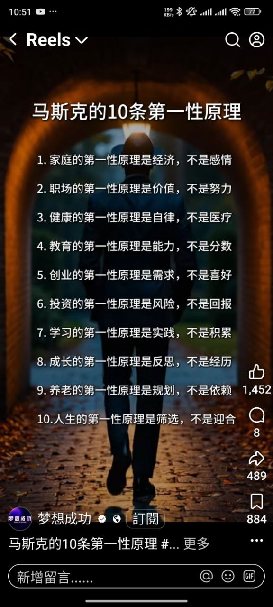

# 马斯克的10条第一性原理

## 📊 元资讯
- **难度**：⭐⭐⭐
- **来源类型**：社交媒体图片
- **来源帐号**：梦想成功（Reels）
- **笔记时间**：2026-01-26 13:34

## 📷 原始图片

## 📌 摘要
以「第一性原理」思维方式，重新定义人生各领域的核心本质。打破常规认知，回归事物的根本驱动力。

## 🏷️ 标签分类
- **大分类**：mindset
- **小分类**：thinking

## 🔑 10条第一性原理

| # | 领域 | 第一性原理 | 而非 |
|---|------|-----------|------|
| 1 | 家庭 | 经济 | 感情 |
| 2 | 职场 | 价值 | 努力 |
| 3 | 健康 | 自律 | 医疗 |
| 4 | 教育 | 能力 | 分数 |
| 5 | 创业 | 需求 | 喜好 |
| 6 | 投资 | 风险 | 回报 |
| 7 | 学习 | 实践 | 积累 |
| 8 | 成长 | 反思 | 经历 |
| 9 | 养老 | 规划 | 依赖 |
| 10 | 人生 | 筛选 | 迎合 |

## 💬 逐条解读

### 1. 家庭的第一性原理是经济，不是感情
经济基础决定上层建筑。家庭稳定需要物质保障，感情是锦上添花。

### 2. 职场的第一性原理是价值，不是努力
职场看的是你创造的价值，而非付出的时间和汗水。努力不等于有效。

### 3. 健康的第一性原理是自律，不是医疗
预防胜于治疗。健康来自日常的自律习惯，医疗只是最后手段。

### 4. 教育的第一性原理是能力，不是分数
真正的教育目标是培养能力，分数只是一种度量工具，不是目的。

### 5. 创业的第一性原理是需求，不是喜好
创业要解决市场需求，而非满足个人喜好。需求决定生存。

### 6. 投资的第一性原理是风险，不是回报
先考虑风险，再考虑回报。不亏钱是赚钱的前提。

### 7. 学习的第一性原理是实践，不是积累
学以致用。知识只有通过实践才能内化，单纯积累无法转化为能力。

### 8. 成长的第一性原理是反思，不是经历
经历不会自动带来成长，反思才能从经历中提炼智慧。

### 9. 养老的第一性原理是规划，不是依赖
提前规划自己的养老，而非依赖子女或他人。

### 10. 人生的第一性原理是筛选，不是迎合
主动筛选适合自己的人和事，而非被动迎合他人的期望。

## 🧠 概念连结
- **第一性原理**：从最基本的假设出发推理，而非类比思考
- **马斯克思维**：SpaceX、Tesla 的创新都基于第一性原理
- **本质思维**：透过现象看本质，找到真正的驱动因素
- **80/20法则**：找到关键的20%，产生80%的效果

## 💡 与我的连结
- 这10条原理的共同点：**回归本质，拒绝表象**
- 每一条都是对「常识」的挑战，提醒我们跳出惯性思维
- 可以作为决策时的检查清单：我是否抓住了第一性原理？

## ✅ 行动项目
- [ ] 对照这10条，检视自己在各领域的认知盲区
- [ ] 深入了解马斯克第一性原理的完整论述
- [ ] 思考：在自己的专业领域，什么是第一性原理？

## 📝 我的注解与思考
这张图虽然是网络流传的内容，不一定是马斯克原话，但其中的思维方式值得借鉴。

核心洞察是：**我们常常把手段当成目的，把表象当成本质**。

比如「教育的第一性原理是能力，不是分数」——分数只是衡量能力的一种方式，但我们常常为了分数而忘记了能力培养的本质。

「投资的第一性原理是风险，不是回报」——这与巴菲特的「第一条规则是不要亏钱，第二条规则是记住第一条」不谋而合。

值得警惕的是，这些原理也不能绝对化。比如「家庭的第一性原理是经济」可能过于功利，感情的价值不应被完全否定。重要的是理解其想表达的意思：不要只谈感情而忽视现实基础。

## ℹ️ 原文资讯
- **原始图片**：[查看图片](../../resources/images/2026-01/2026-01-26-133445.jpg)
- **来源平台**：社交媒体 Reels
- **来源帐号**：梦想成功
- **互动数据**：1,452 赞 / 8 评论 / 489 分享 / 884 收藏
- **收录时间**：2026-01-26 13:34:45
