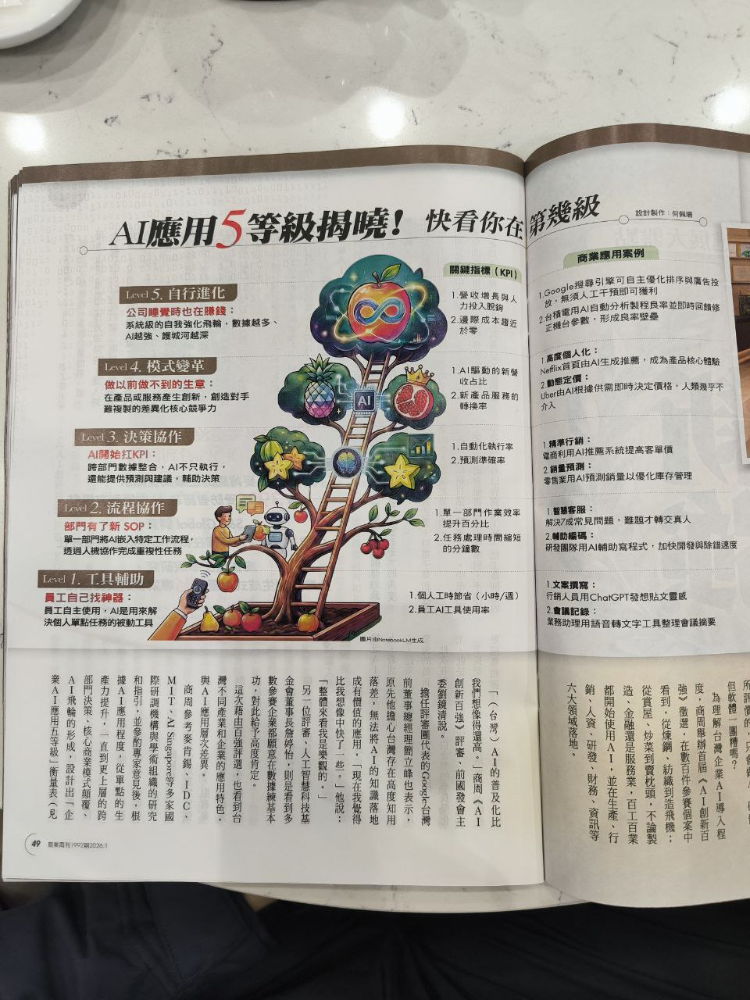

# AI應用5等級揭曉

## 摘要

這篇文章介紹企業AI應用的5個成熟度等級，從基礎的工具輔助到完全自行進化的AI系統，幫助企業評估自身AI應用的發展階段。

## AI應用五等級

### Level 1：工具輔助
- **定義**：員工自己找神器
- **特點**：員工主動使用AI應用來解決個人單點任務的被動工具
- **KPI指標**：
  - 個人工時節省（小時/週）
  - 員工AI工具使用率

### Level 2：流程協作
- **定義**：部門有了新SOP
- **特點**：單一部門將AI導入特定工作流程，透過人機協作完成複雜性任務
- **KPI指標**：
  - 單一部門作業效率提升百分比
  - 任務處理時間縮短的分鐘數

### Level 3：決策協作
- **定義**：AI開始打KPI
- **特點**：跨部門數據整合，AI不只執行，還能提供預測與建議，輔助決策
- **KPI指標**：
  - 自動化執行率
  - 預測準確率

### Level 4：模式變革
- **定義**：做以前做不到的生意
- **特點**：在產品或服務產生創新，創造對手難複製的差異化核心競爭力
- **KPI指標**：
  - AI驅動的新營收占比
  - 產品或服務的轉換率

### Level 5：自行進化
- **定義**：公司睡覺時也在賺錢
- **特點**：系統級的自我強化飛輪，數據越多、AI越強、護城河越深
- **KPI指標**：
  - 營收增長與人力投入脫鉤
  - 邊際成本趨近於零

## 商業應用案例

### 高度個人化
- Netflix 靠演算法由AI生成推薦，成為產品核心價值
- Uber以AI根據需即時決定價格，人類駕手完全無法介入定價過程

### 精準行銷
- 運通利用AI購買系統提高客單價
- 零售業用AI預測銷量以優化庫存管理

### 智慧客服
- 解決常見問題，難題才轉交真人

### 編輯輔助
- 研發團隊用AI輔助寫程式，加快開發與除錯速度

### 文案撰寫
- 行銷人員用ChatGPT發想貼文靈感

### 會議紀錄
- 業務助理用語音轉文字工具整理會議摘要

## 關鍵洞察

1. AI應用成熟度是漸進式的，企業應評估自身所在等級
2. 每個等級都有明確的KPI指標可以衡量
3. 從工具輔助到自行進化，代表AI從「輔助人」到「替代流程」的轉變
4. 高階AI應用能創造競爭對手難以複製的護城河

## 相關連結

- 原始圖片 1：[AI應用等級圖](../../resources/images/2026-01/2026-01-26-141413.jpg)
- 原始圖片 2：[AI應用等級圖](../../resources/images/2026-01/2026-01-26-141814.jpg)
