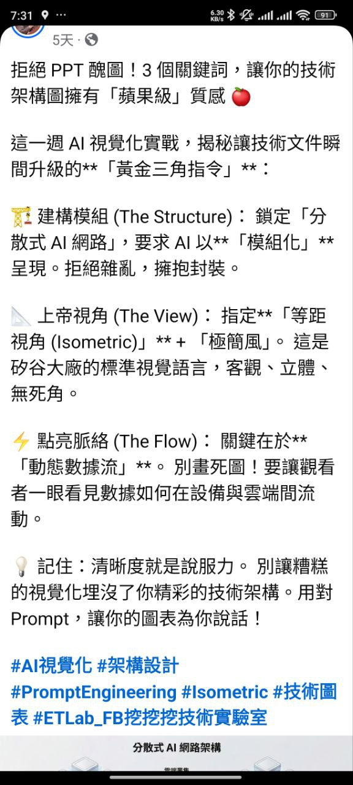

# AI 視覺化實戰——技術架構圖的「黃金三角指令」

## 📊 元資訊
- **來源**：Facebook「ETLab_FB 挖挖挖技術實驗室」
- **收錄時間**：2026-02-03 09:07:10
- **類型**：社群貼文截圖

## 📷 原始圖片

## 📌 摘要
用 AI 生成技術架構圖時，掌握三個關鍵 Prompt 指令（黃金三角），就能讓圖表從「PPT 醜圖」升級為「蘋果級」質感。核心是：模組化結構、等距視角、動態數據流。

## 🔑 黃金三角指令

### 1. 建構模組 The Structure
- 鎖定「分散式 AI 網路」主題
- 要求 AI 以**「模組化」**呈現
- 原則：拒絕雜亂，擁抱封裝

### 2. 上帝視角 The View
- 指定**「等距視角（Isometric）」**+**「極簡風」**
- 這是矽谷大廠的標準視覺語言
- 特點：客觀、立體、無死角

### 3. 點亮脈絡 The Flow
- 關鍵在於**「動態數據流」**
- 別畫死圖！要讓觀看者一眼看見數據如何在設備與雲端間流動

## 💡 核心觀念
> 清晰度就是說服力。別讓糟糕的視覺化埋沒了你精彩的技術架構。用對 Prompt，讓你的圖表為你說話！

## ✅ 實用建議
- 使用 AI 繪圖工具（如 Midjourney、DALL-E）時，在 Prompt 中明確加入：
  - `modular` / `模組化` → 結構清晰
  - `isometric view` / `等距視角` → 專業立體感
  - `data flow animation` / `動態數據流` → 展示運作邏輯
- 搭配極簡風格，避免過多裝飾元素

## 🏷️ 標籤
#AI視覺化 #架構設計 #PromptEngineering #Isometric #技術圖表

## ℹ️ 原始資料
- **圖片位置**：`resources/images/2026-02/2026-02-03-090710.jpg`
- **收錄時間**：2026-02-03 09:07:10
