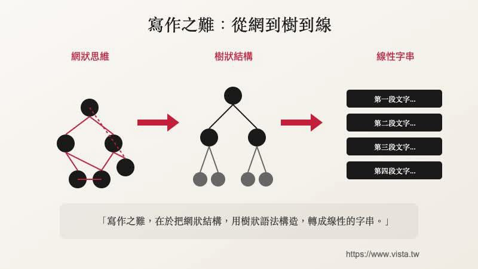

# 寫作之難：從網到樹到線

## 📊 元資訊
- **來源**：vista.tw（鄭緯筌 Vista）
- **收錄時間**：2026-02-03 09:08:05
- **類型**：概念圖

## 📷 原始圖片

## 📌 摘要
寫作的核心難點在於三層轉換：將腦中的**網狀思維**，組織成**樹狀結構**，最終輸出為**線性字串**（文章段落）。這張圖精確描述了寫作過程中思維→結構→文字的轉換本質。

## 🔑 三層轉換模型

### 1. 網狀思維（起點）
- 大腦中的想法是**網狀**的，節點之間互相連結、交叉引用
- 沒有明確的起點和終點，充滿跳躍和關聯
- 這是最自然的思考方式，但無法直接呈現給讀者

### 2. 樹狀結構（中間層）
- 從網狀中提取出**層級關係**，建立主幹→分支→葉節點
- 決定哪些是主要論點、哪些是支撐細節
- 這一步是**大綱規劃**的過程

### 3. 線性字串（輸出）
- 最終將樹狀結構**攤平**為一段一段的文字序列
- 第一段文字→第二段→第三段→第四段…
- 讀者只能線性閱讀，所以必須有清晰的順序

## 💬 金句
> 「寫作之難，在於把網狀結構，用樹狀語法構造，轉成線性的字串。」

## 💡 啟發與應用
- **知識管理**：Zettelkasten（卡片盒筆記法）就是先保留網狀連結，再在輸出時轉為線性
- **AI 輔助寫作**：可以讓 AI 幫忙做「網→樹」的結構化，人類專注「樹→線」的表達
- **簡報製作**：同樣適用——腦中想法是網狀的，簡報必須是線性的，中間需要樹狀大綱
- **程式設計文件**：技術文件撰寫也是同樣的轉換過程

## 🏷️ 標籤
#寫作方法 #思維結構 #資訊架構 #知識管理 #內容創作

## ℹ️ 原始資料
- **圖片位置**：`resources/images/2026-02/2026-02-03-090805.jpg`
- **來源網站**：https://www.vista.tw
- **收錄時間**：2026-02-03 09:08:05
